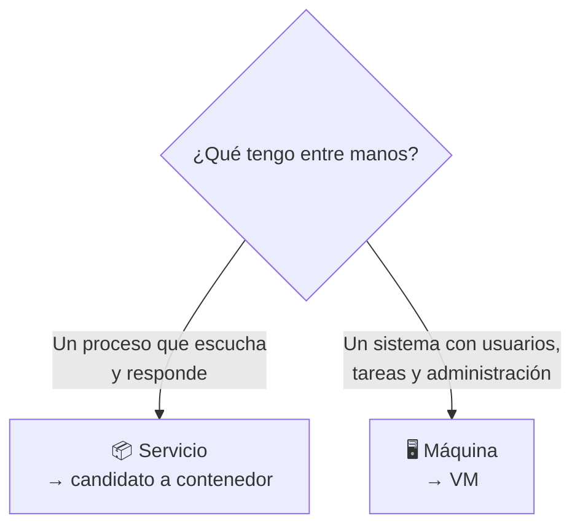
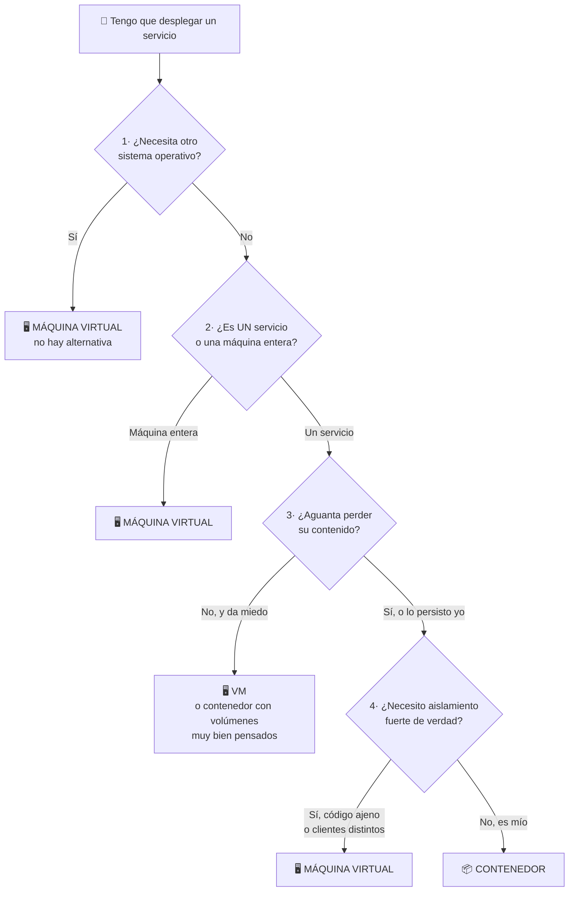
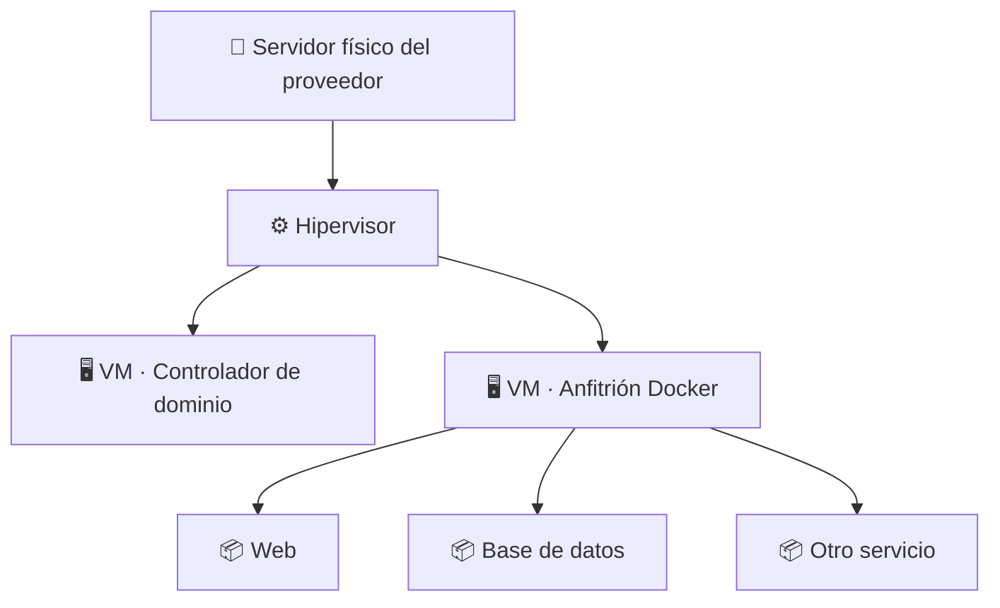

## B6.0.2 — Contenedor frente a máquina virtual

> [!abstract] Ficha del documento
> ### 📌 `B6.0.2` — Contenedor frente a máquina virtual
> - **Bloque 6** (Aislamiento de servicios) · **Fase B6.0** (El concepto) · **Nivel 1** (Básico) · **RA1**
> - **Tipo:** documento de **concepto**. No se graba con OBS y no se entrega.
> - **Requisito previo:** [[B6_0.1_Que_es_un_contenedor|B6.0.1 — ¿Qué es un contenedor?]]. Si no lo has leído, este no se entiende.
> - **Tiempo:** 35 minutos de lectura tranquila.

> [!warning] Este documento no repite el anterior
> En B6.0.1 aprendiste **qué son** las dos cosas y en qué se diferencian por dentro. Eso ya está.
>
> Aquí la pregunta es otra, y es mucho más difícil: **te dan un servicio que montar, ¿qué eliges?**
>
> Saber la diferencia técnica es de primero. Saber decidir es lo que te van a pedir en una empresa.

---

## ⚖️ La pregunta mal planteada

Voy a quitarte de la cabeza una idea antes de que se te instale, porque la vas a leer en internet cien veces.

> [!danger] "¿Qué es mejor, una VM o un contenedor?"
> **Es una pregunta sin respuesta.** Como preguntar si es mejor un destornillador o un martillo.
>
> Quien te diga "los contenedores son mejores, las VMs están obsoletas" no ha administrado un servidor en su vida. Las máquinas virtuales no solo no han desaparecido: **los contenedores del mundo real se ejecutan casi siempre dentro de máquinas virtuales.** En Azure y en AWS, cuando despliegas contenedores, por debajo hay VMs. Siempre.

La pregunta correcta es:

> [!important] La pregunta buena
> **"Para *este* servicio concreto, en *esta* situación concreta, ¿qué me conviene?"**
>
> Y para responderla no hace falta intuición ni experiencia: hace falta un método. Eso es lo que viene ahora.

---

## 🧭 Los cinco ejes de decisión

Cada vez que tengas que decidir, pásale al servicio estas cinco preguntas **en este orden**. La primera que dé un "no" decide por ti.

### 1️⃣ ¿Necesito un sistema operativo distinto al del anfitrión?

> [!question] La pregunta eliminatoria
> Si la respuesta es **sí**, se acabó la conversación: **máquina virtual**. No hay debate ni matiz.

Ya sabes por qué: el contenedor **comparte el kernel del anfitrión**. Un Ubuntu no puede prestarle un kernel de Windows a nadie, porque no lo tiene.

| Quiero ejecutar… | …sobre un anfitrión Ubuntu | Veredicto |
|---|---|---|
| Un servicio Linux | Comparte kernel Linux ✅ | Contenedor |
| Windows Server | Necesita kernel Windows ❌ | **VM obligatoria** |
| Otra distribución Linux (Alpine, Debian…) | El kernel es Linux igualmente ✅ | Contenedor |

> [!tip] Ojo con la tercera fila, que sorprende
> Puedes ejecutar un contenedor de **Alpine** o de **Debian** sobre tu **Ubuntu** sin problema. Suena raro, pero es coherente: lo que cambia entre distribuciones son los ficheros, los paquetes y el gestor de paquetes — **el kernel es Linux en todas**. Y el kernel es lo único que se comparte.
>
> Es decir: contenedor ≠ mismo sistema operativo. Contenedor = **mismo tipo de kernel**.

### 2️⃣ ¿Es un servicio, o es una máquina completa?

Esta es la que más se falla, así que léela despacio.

> [!example] La diferencia
> - **Un servicio** hace *una cosa*: servir páginas web, guardar datos, resolver nombres. Arranca, escucha en un puerto, responde. Un solo trabajo.
> - **Una máquina** hace *muchas cosas a la vez*: tiene usuarios que entran por SSH, tareas programadas, varios demonios conviviendo, alguien administrándola día a día.

Un contenedor está diseñado para ejecutar **un proceso principal**. Si te descubres pensando *"y dentro del contenedor arranco también el SSH, y el cron, y ya de paso…"*, para: **has elegido mal la herramienta.** Eso es una máquina y quiere ser una máquina.

### 3️⃣ ¿Qué pasa si esto desaparece de golpe?

Ya sabes que un contenedor es **efímero**: lo borras y se va todo lo que había dentro (lo comprobarás en carne propia en B6.2.3).

> [!question] Hazte esta pregunta con honestidad
> Si mañana este servicio se borra entero y arranca de cero **en blanco**, ¿es una molestia de dos minutos o es una catástrofe?

- **"Se levanta otro y listo"** → contenedor. Es exactamente para lo que sirve.
- **"Perdería el estado de años y no sabría reconstruirlo"** → o VM, o un contenedor con la persistencia muy bien resuelta (fase B6.4). Y si tienes dudas, VM.

> [!note] Matiz importante, que no cunda el pánico
> Esto **no** significa que un contenedor no pueda guardar datos. Puede, y la fase B6.4 es entera sobre eso. Significa que **guardar datos en un contenedor exige que tú lo decidas y lo configures a propósito**. En una VM el disco persiste porque sí; en un contenedor persiste porque tú lo has montado.

### 4️⃣ ¿Cuánto va a vivir esto?

> [!example] El eje del tiempo
> - **Minutos u horas** — probar una versión, hacer una demo, montar algo para una clase, comprobar si un fallo se reproduce → **contenedor**, sin dudarlo. Lo levantas, lo usas, lo tiras.
> - **Meses o años** — la infraestructura de la que depende la empresa → mira los otros cuatro ejes antes de decidir.

Este eje es el más práctico de todos y el que más vas a usar tú personalmente. ¿Quieres probar una base de datos sin ensuciar tu servidor? Un contenedor, dos minutos, y al terminar no queda ni rastro. Con una VM eso son veinte minutos de instalación y 15 GB de disco.

### 5️⃣ ¿Cuánto aislamiento necesito de verdad?

> [!warning] El eje de seguridad
> El contenedor comparte kernel. Si alguien encuentra un fallo en ese kernel, **el aislamiento se puede romper** y afectar al anfitrión y a los demás contenedores.
>
> Con una máquina virtual el aislamiento lo impone el hipervisor, un escalón por debajo. Es más difícil de saltar.

Traducción práctica:

- Servicios tuyos, de tu red interna, que tú controlas → el aislamiento del contenedor **sobra**.
- Código de terceros en el que no confías, o clientes distintos que no deben verse entre ellos → **VM**.

---

## 🌳 El árbol de decisión completo

Los cinco ejes, en el orden en que hay que preguntárselos:

> [!tip] Fíjate en algo
> **Cuatro de las cinco salidas llevan a una máquina virtual.** No es un error del dibujo ni una manía mía: es que las VMs siguen siendo la opción correcta muchísimas veces.
>
> El contenedor gana en un caso muy concreto —**un servicio, mío, Linux, que puedo tirar y recrear**— pero resulta que ese caso es *extremadamente* frecuente en la informática moderna. De ahí su éxito.

---

## 🏢 Aplicado a Boochan, que es lo tuyo

Vamos a pasarle el árbol de decisión a la infraestructura que llevas montando todo el curso. Esto no es un ejercicio teórico: es la justificación de por qué el bloque está montado como está.

| Elemento de Boochan | Decisión | Por qué |
|---|---|---|
| **Controlador de dominio** (Samba AD DC / AD DS) | 🖥️ **VM** | Falla el eje 2 (es una máquina entera, no un servicio) y el eje 3 (perder el directorio es catastrófico). En AD DS falla además el eje 1. |
| **Cliente Windows 11** | 🖥️ **VM** | Eje 1: es Windows. Fin. |
| **WireGuard** | 🖥️ **VM** | Toca el kernel del anfitrión y define la red de toda la infraestructura. No es un servicio aislable. |
| **Servidor web de pruebas** | 📦 **Contenedor** | Un servicio, Linux, mío, y si se borra levanto otro. Los cinco ejes en verde. |
| **Base de datos de una práctica** | 📦 **Contenedor** con volumen | Servicio Linux, pero el eje 3 obliga a persistir bien. Justo lo de la fase B6.4. |
| **Probar una versión nueva de algo** | 📦 **Contenedor** | Eje 4: vive diez minutos. |

> [!danger] Por eso el controlador de dominio no se contenedoriza
> Ya te lo avisé en el índice del bloque, pero ahora **tienes el razonamiento completo** y no es una imposición del profesor: es lo que sale de aplicar el método.
>
> Un DC en contenedor falla dos o tres ejes de los cinco. Cualquier administrador con experiencia llegaría a la misma conclusión.

---

## 🤝 Lo que hace la industria de verdad: las dos cosas

Si te quedas con "o una cosa o la otra", te pierdes cómo funciona esto en el mundo real.

> [!info] Lee el dibujo de abajo arriba
> Hay **máquinas virtuales** por debajo dando aislamiento fuerte y separación entre sistemas. Y dentro de una de ellas, **contenedores** dando agilidad y densidad para los servicios.
>
> Cada herramienta en la capa donde es buena. Esto es exactamente lo que vas a montar tú: tu Ubuntu Server (que es una VM en VirtualBox, Azure o AWS) va a ser el **anfitrión Docker** del bloque.

> [!tip] Reformula la pregunta para siempre
> No es *"¿VM o contenedor?"*.
> Es *"¿**qué pongo en cada capa**?"*.

---

## 🚫 Los cuatro errores de criterio típicos

> [!danger] Errores que va a cometer alguien de tu clase
> **1. "Contenedorizo todo, que es lo moderno."**
> Acabas metiendo el controlador de dominio en un contenedor y descubriendo a las tres semanas por qué nadie lo hace. Lo moderno no es contenedorizar todo: es **saber elegir**.
>
> **2. "Los contenedores son inseguros, no los toco."**
> El extremo contrario, y también falso. Un contenedor bien configurado y sin privilegios es perfectamente sólido para servicios internos. Rechazarlos entero es renunciar a la herramienta correcta para media docena de trabajos.
>
> **3. "Como es un contenedor, ya va rápido."**
> El contenedor no acelera tu programa. Lo que arranca en un segundo es el **entorno**, no el código. Si tu servicio es lento, en contenedor será igual de lento.
>
> **4. "Lo meto en un contenedor y así ya está respaldado."**
> Al revés: por defecto un contenedor **no guarda nada**. Sin volúmenes bien montados, contenedorizar algo lo hace *más* frágil, no menos. Copias de seguridad las sigues necesitando exactamente igual.

---

## ✅ Comprueba que lo has entendido

> [!question] Decide y **justifica con el eje que corresponda**
> No vale contestar "contenedor" o "VM" a secas: di **qué eje** te ha hecho decidir.
>
> 1. Tienes que montar un servidor de impresión para el aula, con Windows Server, que llevará años funcionando. ¿Qué eliges?
> 2. Quieres probar si una web funciona igual con la versión 1.24 de Nginx que con la 1.26. Vas a tardar quince minutos.
> 3. Un compañero quiere montar el Samba AD DC del proyecto en un contenedor "para que ocupe menos". Escríbele la respuesta en tres líneas.
> 4. Necesitas un servidor de base de datos para una práctica que dura todo el trimestre y cuyos datos no puedes perder.
> 5. Un cliente te da un programa suyo, cerrado, que no sabes qué hace por dentro, y quiere que lo ejecutes en tu servidor. ¿Dónde lo pones y por qué?
> 6. ¿Por qué un proveedor de nube ejecuta tus contenedores dentro de máquinas virtuales, en lugar de ponerlos directamente sobre el hardware?

> [!summary] 🎓 Lo que tienes que llevarte de aquí
> - **"¿Cuál es mejor?" no es una pregunta válida.** La buena es "¿qué le conviene a *este* servicio?".
> - Los **cinco ejes**, en orden: ¿otro sistema operativo? · ¿servicio o máquina? · ¿aguanta desaparecer? · ¿cuánto vive? · ¿cuánto aislamiento necesita?
> - El **primer "no" decide**. No hace falta llegar al final.
> - El contenedor gana en un caso concreto —**un servicio Linux, tuyo, recreable**— que resulta ser muy común.
> - En la vida real **no compiten: se apilan**. Contenedores dentro de VMs, cada herramienta en su capa.
> - El **controlador de dominio se queda en su máquina**, y ahora sabes justificar por qué sin recurrir a "lo dijo el profesor".
>
> **Siguiente:** [[B6_0.3_Vocabulario|B6.0.3 — Vocabulario: imagen, contenedor, registro, capa]], el último documento de concepto antes de encender el ordenador.
