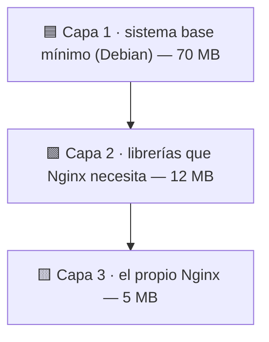

## B6.0.3 — Vocabulario: imagen, contenedor, registro y capa

> [!abstract] Ficha del documento
> ### 📌 `B6.0.3` — Vocabulario: imagen, contenedor, registro y capa
> - **Bloque 6** (Aislamiento de servicios) · **Fase B6.0** (El concepto) · **Nivel 1** (Básico) · **RA1**
> - **Tipo:** documento de **concepto**. No se graba con OBS y no se entrega.
> - **Requisito previo:** [[B6_0.1_Que_es_un_contenedor|B6.0.1]] y [[B6_0.2_Contenedor_vs_Maquina_Virtual|B6.0.2]].
> - **Tiempo:** 30 minutos. **Es el último documento sin ordenador.**

> [!warning] Por qué un documento entero solo de palabras
> Porque en cuanto empieces a teclear vas a leer mensajes como `Unable to find image 'nginx:latest' locally`, `Pulling from library/nginx` o `Error: No such container`. Cuatro palabras técnicas en una línea.
>
> Y sobre todo por esto: **no puedes pedir ayuda si no sabes nombrar lo que te pasa.** Si le dices a alguien *"se me ha roto el Docker"*, nadie puede ayudarte. Si dices *"la imagen se descarga pero el contenedor muere al arrancar"*, cualquiera te resuelve el problema en dos minutos.
>
> Media hora de vocabulario ahora es la diferencia entre depurar y adivinar.

---

## 🧠 Las dos que ya tienes (repaso de treinta segundos)

Estas dos las trabajaste en B6.0.1. Solo las dejo aquí para tenerlo todo junto:

> [!example] Imagen y contenedor
> - **Imagen** — la plantilla de solo lectura. Está **quieta en el disco**. No se ejecuta.
> - **Contenedor** — una instancia **viva** creada a partir de una imagen. Consume RAM. Se puede parar.
>
> *La receta y la tarta.*

Lo nuevo empieza aquí.

---

## 🌐 Registro: de dónde salen las imágenes

Cuando escribas `docker run nginx`, tu servidor no tiene esa imagen. Va a buscarla a algún sitio. Ese sitio es el **registro**.

> [!tip] Esto ya lo conoces, aunque no con este nombre
> Piensa en `apt install`. Tú escribes el nombre de un paquete, y `apt` lo busca en unos **repositorios** configurados en tu sistema, se lo descarga y lo instala. Nunca te has preguntado de dónde sale: hay un almacén central y tu máquina sabe llegar a él.
>
> **Un registro es exactamente eso, pero de imágenes.** El registro por defecto se llama **Docker Hub**, y es a donde va tu Docker cuando no le dices otra cosa.

| En `apt` | En Docker |
|---|---|
| Repositorio (`archive.ubuntu.com`) | **Registro** (Docker Hub) |
| Paquete (`nginx`) | **Imagen** (`nginx`) |
| `apt install nginx` | `docker pull nginx` |
| El servicio ya instalado y corriendo | **Contenedor** |

> [!warning] La diferencia que sí importa
> Un paquete de `apt` **se instala dentro de tu sistema** y lo modifica. Una imagen **no toca tu sistema**: se queda guardada aparte, esperando a que crees contenedores con ella.
>
> Por eso puedes tener a la vez las imágenes de PostgreSQL 14 y PostgreSQL 16 sin que se peleen. Con `apt` eso es un problema serio. Aquí no es ni un problema.

---

## 🏷️ Etiqueta: qué versión exactamente

Una imagen no es solo un nombre. Es **nombre + etiqueta** (*tag*), separados por dos puntos:

```
nginx:1.26        ← imagen "nginx", versión 1.26
ubuntu:24.04      ← imagen "ubuntu", versión 24.04
nginx             ← ¡ojo! esto significa nginx:latest
```

> [!danger] El fallo nº1 con las etiquetas: `latest`
> Si no pones etiqueta, Docker asume **`:latest`**. Y `latest` no significa *"la última versión"* como tú lo entiendes: significa *"la que el autor haya marcado como latest ese día"*.
>
> Consecuencia práctica: montas algo hoy con `nginx`, funciona. Lo montas dentro de tres meses con el mismo comando, y **te bajas una imagen distinta**. Si algo se rompe, no vas a entender por qué, porque tu comando no ha cambiado.
>
> **En cualquier cosa que tenga que durar, pon la versión exacta.** `latest` vale para probar cosas y para nada más.

---

## 🧅 Capa: por qué una imagen ocupa tan poco

Esta es la palabra que casi nadie explica y la que hace que todo lo demás encaje.

Una imagen **no es un fichero grande y macizo**. Está hecha de **capas** apiladas, cada una de solo lectura.

> [!example] Las hojas de acetato
> Imagina las transparencias de acetato de un retroproyector. Pones una hoja con el mapa de España. Encima, otra con las carreteras. Encima, otra con las ciudades.
>
> Miras desde arriba y **ves un solo dibujo completo**. Pero son tres hojas independientes, y **la del mapa la puedes reutilizar** para cualquier otro dibujo sin volver a pintarla.

Una imagen de Nginx es más o menos así:



### Las dos consecuencias que vas a notar

> [!info] 1. La segunda descarga es casi instantánea
> Descargas `nginx` y tarda. Después descargas otra imagen que también usa Debian de base, y verás en pantalla `Already exists` en varias líneas.
>
> **No se descarga dos veces lo que ya tienes.** Las capas compartidas se guardan una sola vez en tu disco, aunque diez imágenes distintas las usen.
>
> Por eso `docker images` puede decirte que tienes 5 imágenes de 100 MB cada una y que en disco ocupan 250 MB en total, no 500. No es un error de la herramienta.

> [!important] 2. La capa de escritura: aquí está la clave de todo
> Cuando arrancas un contenedor, Docker añade **una capa más encima, y esa sí es de escritura**. Todo lo que el contenedor cree, modifique o borre mientras vive se queda ahí.
>
> ```mermaid
> flowchart TB
>     I["🖼️ IMAGEN — capas de SOLO LECTURA<br/>compartidas por todos los contenedores"]
>     W1["✏️ Capa de escritura · Contenedor 1"]
>     W2["✏️ Capa de escritura · Contenedor 2"]
>     I --> W1
>     I --> W2
> ```
>
> **Y cuando borras el contenedor, se borra esa capa. Solo esa.** La imagen queda intacta.

> [!tip] Acabas de entender por qué un contenedor es efímero
> En B6.0.2 te dije que un contenedor pierde su contenido al borrarlo, y te lo pedí a crédito. **Aquí está el motivo, y no es un capricho de diseño:**
>
> Lo que escribes vive en una capa que pertenece al contenedor, no a la imagen. Borras el contenedor → borras su capa → adiós a los datos.
>
> Esto también explica por qué dos contenedores de la misma imagen **no se ven los ficheros entre ellos**: comparten las capas de abajo, pero cada uno tiene la suya propia arriba.

---

## 🔧 Las tres palabras que verás en los mensajes de error

> [!example] Mini-glosario para no perderte
> - **Anfitrión (*host*)** — la máquina real donde corre todo. Tu Ubuntu Server.
> - **Motor (*Docker Engine*)** — el programa que gestiona imágenes y contenedores. Cuando leas *"Cannot connect to the Docker daemon"*, te está diciendo que **el motor no está arrancado**, no que tu contenedor falle.
> - **Volumen** — el almacén que sobrevive al contenedor. Es la respuesta al problema de la capa de escritura, y es la fase **B6.4** entera. Por ahora quédate con que existe.

---

## ⚠️ Las tres confusiones que hay que matar hoy

> [!danger] Distingue bien estas tres parejas
> **1. `docker rm` frente a `docker rmi`**
> `rm` borra un **contenedor**. `rmi` borra una **imagen** (*remove image*). Una letra de diferencia y un desastre distinto. Si borras la imagen, tienes que volver a descargarla; si borras el contenedor, pierdes sus datos.
>
> **2. Imagen ≠ contenedor parado**
> Un contenedor parado **sigue existiendo** y sigue conservando su capa de escritura: puedes volver a arrancarlo con `docker start` y encontrarlo como lo dejaste. No es lo mismo que la imagen. Parar no es borrar.
>
> **3. Registro ≠ imagen**
> El registro es el **almacén**; la imagen es **lo que hay dentro**. Docker Hub no es "un Docker": es la biblioteca de la que descargas.

---

## ✅ Comprueba que lo has entendido

> [!question] Responde con tus palabras
> 1. Explica la relación entre **registro, imagen y contenedor** usando una comparación con `apt`.
> 2. ¿Por qué descargar la segunda imagen suele ser mucho más rápido que la primera?
> 3. Escribes `docker run nginx`. ¿Qué versión te estás bajando exactamente? ¿Por qué es un problema en un servidor de verdad?
> 4. Un contenedor guarda un fichero y luego lo borras. ¿Dónde estaba ese fichero y por qué desaparece? *(Pista: la respuesta lleva la palabra capa.)*
> 5. Diferencia entre `docker rm` y `docker rmi`. ¿Cuál de los dos te obliga a volver a descargar algo?
> 6. Dos contenedores creados de la misma imagen: ¿comparten los ficheros que crean? Razónalo.

> [!summary] 🎓 Lo que tienes que llevarte de aquí
> - **Registro** = el almacén de imágenes (Docker Hub). Es a Docker lo que los repositorios son a `apt`.
> - **Etiqueta** = la versión. **`latest` no es "la última": es una trampa** en cualquier cosa que tenga que durar.
> - **Capa** = las imágenes se apilan en capas de solo lectura, y **se comparten** entre imágenes. De ahí que ocupen y tarden tan poco.
> - **La capa de escritura** es del contenedor, no de la imagen. **Ahí está la explicación de que un contenedor sea efímero.**
> - `rm` borra contenedores, `rmi` borra imágenes. Una letra, dos desastres distintos.
>
> ---
>
> **Con esto se cierra la Fase B6.0.** Ya tienes el concepto, el criterio para decidir y el vocabulario.
>
> **Siguiente:** `B6.1.1 — Instalar Docker Engine en Ubuntu Server`. **Ahora sí: enciende el ordenador y arranca OBS.**
