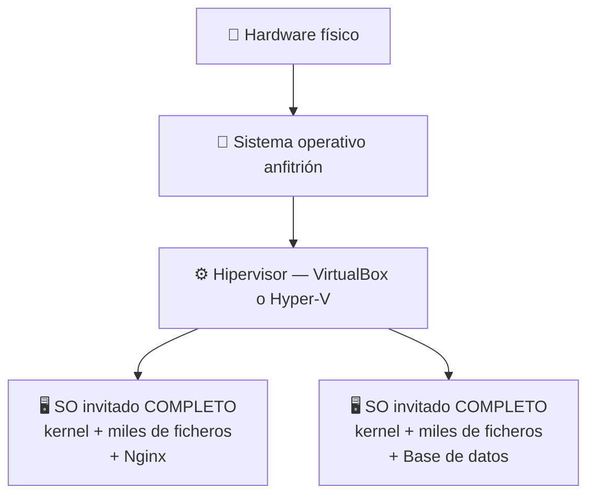
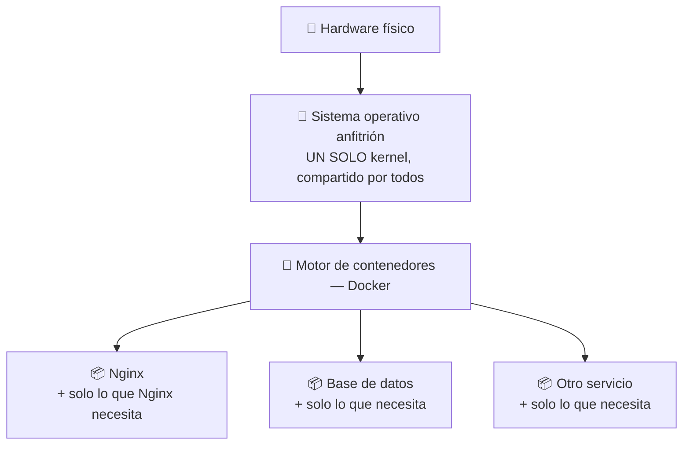
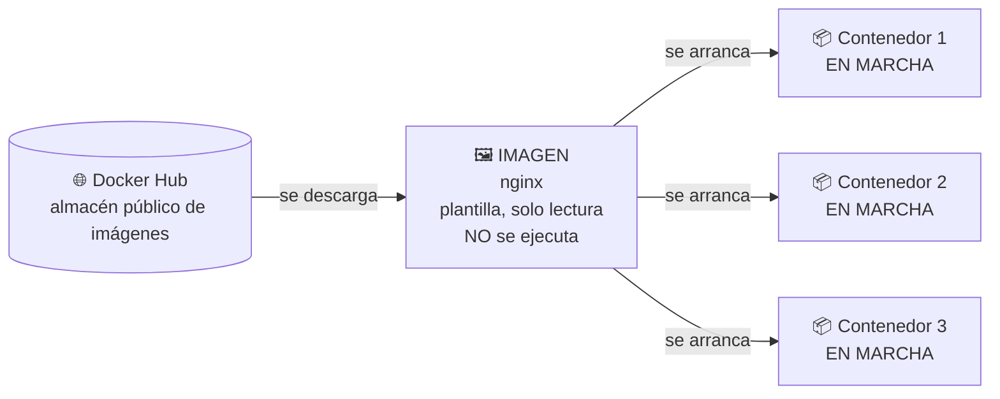

## B6.0.1 — ¿Qué es un contenedor?

> [!abstract] Ficha del documento
> ### 📌 `B6.0.1` — ¿Qué es un contenedor?
> - **Bloque 6** (Aislamiento de servicios) · **Fase B6.0** (El concepto) · **Nivel 1** (Básico) · **RA1**
> - **Tipo:** documento de **concepto**. No se graba con OBS y no se entrega.
> - **Cuándo leerlo:** antes de instalar nada. Ni siquiera necesitas el ordenador encendido.
> - **Tiempo:** 40 minutos de lectura tranquila.

> [!warning] Lee esto primero
> Este documento **no tiene comandos**. Ni uno.
>
> Sé que apetece ir directo a teclear, pero si empiezas a escribir comandos de Docker sin haber entendido qué es un contenedor, vas a acabar copiando líneas de internet sin saber qué hacen. Y cuando algo falle —que fallará— no vas a tener ni idea de por dónde empezar a mirar.
>
> Cuarenta minutos ahora te ahorran el bloque entero después.

---

## 🧩 Empecemos por el problema

Antes de explicarte qué es un contenedor, necesito que reconozcas el problema que vino a resolver. Porque una herramienta que no resuelve ningún problema tuyo es una herramienta que vas a olvidar en dos semanas.

> [!question] Piensa en lo que ya te ha pasado este curso
> Durante todo el curso has instalado servicios en tu servidor: Samba, un servidor web, WireGuard, cuotas de disco… Y seguro que has vivido al menos una de estas tres situaciones:
>
> 1. **Instalaste algo y se rompió otra cosa.** Un paquete pisó la configuración de otro, o dos programas necesitaban versiones distintas de la misma librería.
> 2. **Querías probar algo sin arriesgarte** a destrozar el servidor que tanto te costó montar, y no te atrevías.
> 3. **Te funcionaba a ti pero no a tu compañero**, con los mismos pasos, y nadie sabía por qué.

Esos tres problemas tienen una raíz común: **todos los servicios comparten el mismo sistema operativo**. Viven en la misma casa, usan las mismas librerías, escriben en las mismas carpetas y se pisan entre ellos.

### La primera solución que ya conoces: una máquina para cada cosa

La solución clásica la has practicado en UD03 y UD04: si quieres que dos servicios no se molesten, les das **una máquina virtual a cada uno**. Servidor web en una VM, base de datos en otra. Aislamiento perfecto.

Funciona. Pero fíjate en lo que cuesta:

> [!example] Haz la cuenta tú mismo
> Quieres tres servicios aislados. Con máquinas virtuales necesitas:
> - **3 sistemas operativos completos** instalados, cada uno con sus miles de ficheros
> - **3 × 2 GB de RAM** como mínimo, aunque el servicio de verdad use 50 MB
> - **3 × 15 GB de disco**
> - **3 arranques** de un minuto cada uno
> - **3 sistemas que actualizar** todos los meses
>
> Y de todo eso, lo único que tú querías era ejecutar tres programas.

Ahí está el desperdicio: **estás instalando un sistema operativo entero para poder ejecutar un programa de 20 MB.** Es como comprarte tres casas porque quieres tres neveras.

---

## 🚢 De dónde viene la palabra "contenedor"

La palabra no es un capricho técnico. Es una analogía **muy buena**, y merece la pena entenderla porque explica el 80% de la idea.

> [!info] 1956, el puerto de Newark
> Antes de esa fecha, cargar un barco era un caos. Cada mercancía venía en su propio embalaje: sacos de café, cajas de madera, bidones, fardos. Los estibadores lo colocaban todo a mano, pieza a pieza. Cargar un barco tardaba **semanas** y la mitad se rompía o se robaba.
>
> Un transportista llamado Malcolm McLean propuso algo aparentemente tonto: **una caja metálica estándar**, siempre del mismo tamaño, con los mismos anclajes. Da igual lo que metas dentro —café, coches, ropa—: por fuera todas las cajas son idénticas.
>
> El resultado fue una revolución. El barco, la grúa, el camión y el tren **ya no necesitan saber qué llevan dentro.** Solo saben mover cajas estándar. Cargar un barco pasó de semanas a horas.

Traduce eso a la informática:

| En el puerto | En tu servidor |
|---|---|
| Mercancía suelta y desordenada | Un programa con sus librerías, sus versiones y sus manías |
| El contenedor metálico estándar | El **contenedor de software**: el programa empaquetado con todo lo que necesita |
| La grúa, el barco, el camión | Tu servidor, el portátil de tu compañero, un servidor en la nube |
| "Da igual qué lleva dentro" | El sistema anfitrión **no necesita saber** qué hay dentro del contenedor |

> [!tip] Idea clave
> Un contenedor es **una caja estándar**. Dentro va tu programa con todo lo que necesita para funcionar. Fuera, todas las cajas se manejan igual: se arrancan igual, se paran igual, se copian igual.
>
> Por eso desaparece el "a mí me funcionaba": si la caja funciona, funciona en cualquier sitio, porque **lo que necesita va dentro de la caja**.

---

## 🏢 Ahora, qué es técnicamente

La analogía del barco explica *para qué sirve*. Vamos con *qué es de verdad*, y para eso necesitamos otra imagen.

> [!example] Casas independientes frente a pisos en un edificio
> **Una máquina virtual es un chalet.** Tiene sus propios cimientos, sus propias paredes, su propia instalación eléctrica, su propia caldera y su propio tejado. Está totalmente separada de las demás. Y por eso es cara: duplicas la estructura entera, aunque solo quieras una habitación.
>
> **Un contenedor es un piso en un bloque.** Tiene su propia puerta con su propia llave, sus habitaciones, sus muebles. Nadie del piso de al lado puede entrar. Pero **los cimientos, la estructura y la caldera son del edificio y se comparten.**
>
> Un piso te da intimidad de verdad. Pero no vuelves a construir los cimientos para cada vecino.

Y ahora la traducción exacta, que es **la frase más importante de todo este bloque**:

> [!important] La definición
> **Los cimientos compartidos son el núcleo del sistema operativo — el kernel.**
>
> - Una **máquina virtual** virtualiza el *hardware*: crea un ordenador falso completo y le instalas dentro un sistema operativo entero, con su propio kernel.
> - Un **contenedor** no virtualiza nada. Es simplemente **un proceso normal del sistema anfitrión, al que el kernel le ha puesto vendas en los ojos** para que crea que está solo en la máquina.

Lee otra vez esa última línea, porque es la que separa a quien entiende contenedores de quien solo copia comandos:

**Un contenedor es un proceso corriente de tu Ubuntu.** No es una máquina. No hay nada arrancando. Es un programa ejecutándose en tu servidor, exactamente igual que Nginx o Samba, solo que el kernel le ha mentido sobre lo que hay a su alrededor: le enseña un sistema de archivos que no es el tuyo, una lista de procesos donde solo se ve a sí mismo y una red que parece suya.

> [!note] Y esto lo vas a comprobar con tus propios ojos
> En la práctica **B6.2.2** vas a arrancar un contenedor y luego, desde tu servidor, vas a ejecutar `ps aux`. Y vas a ver **el proceso del contenedor en la lista de procesos de tu Ubuntu**, como un programa más.
>
> Con una máquina virtual eso es imposible: los procesos de dentro no se ven desde fuera. Esa es la demostración de que un contenedor no es una máquina.

---

## 📊 Las dos arquitecturas, dibujadas

**Con máquinas virtuales** (lo que has hecho en UD03 y UD04):

**Con contenedores**:

> [!question] Mira los dos dibujos y responde
> ¿Cuántas veces aparece la palabra **kernel** en cada dibujo? Ahí está toda la diferencia. En el primero, uno por cada máquina. En el segundo, **uno para todos**.

### La comparación, en números

| | 🖥️ Máquina virtual | 📦 Contenedor |
|---|---|---|
| **Qué aísla** | El hardware completo | Un proceso |
| **Kernel** | Uno propio por máquina | Comparte el del anfitrión |
| **Tiempo de arranque** | Un minuto o más | Menos de un segundo |
| **RAM que ocupa** | Gigas (el SO entero) | Solo lo que use el programa |
| **Tamaño en disco** | 10–20 GB | 20–200 MB |
| **Aislamiento** | Total | Fuerte, pero comparte kernel |
| **¿Puedo poner Windows sobre Linux?** | Sí | **No** |

> [!warning] Ese "No" de la última fila es importante
> Como el contenedor **comparte el kernel del anfitrión**, solo puede ejecutar programas del mismo tipo de sistema. En un Linux corren contenedores Linux. Punto.
>
> Cuando en la fase B6.5 ejecutes contenedores Linux "sobre Windows", lo que ocurre por debajo es que Windows arranca un Linux de verdad y discreto (**WSL2**) para prestarle su kernel. No es magia: es que hace falta un kernel Linux, y si no lo hay, alguien tiene que ponerlo.
>
> Esto no es un detalle menor: es exactamente el contenido de **RA6 — integración de sistemas operativos libres y propietarios**.

---

## 🖼️ Imagen y contenedor: la confusión número uno

Casi todo el mundo confunde estas dos palabras al empezar. Vamos a matarlo ahora.

> [!example] La analogía
> - Una **imagen** es la *receta* de una tarta: escrita, guardada, que no cambia. Nadie se come una receta.
> - Un **contenedor** es *la tarta* que has hecho siguiendo esa receta. Existe de verdad, se puede comer, y se puede estropear.
>
> De una receta salen todas las tartas que quieras. Y si se te quema una tarta, la tiras y haces otra: **la receta sigue intacta**.

> [!tip] La regla para no equivocarte nunca
> **La imagen está quieta en el disco. El contenedor está vivo y consumiendo RAM.**
>
> Si algo se puede parar, se llama contenedor. Si algo se descarga, se llama imagen.

---

## ❌ Lo que un contenedor NO es

Tan importante como saber qué es algo, es saber qué no es. Estas cuatro confusiones son las habituales:

> [!danger] Cuatro cosas falsas que oirás por ahí
> **1. "Un contenedor es una máquina virtual pequeña."**
> Falso, y es el error más grave. No hay ninguna máquina. Es un proceso del anfitrión. Si te quedas con esta idea equivocada, no vas a entender ni los permisos ni la red del bloque.
>
> **2. "Lo que hay dentro del contenedor está guardado."**
> Falso. Por defecto, cuando borras un contenedor **se pierde todo lo que hubiera dentro**. No es un fallo, es a propósito. Cómo conservar los datos es justamente la fase B6.4.
>
> **3. "Un contenedor es seguro por definición."**
> Falso. Está aislado, sí, pero comparte kernel con tu servidor. Un contenedor mal configurado puede ser una puerta de entrada. Por eso hay una práctica entera (B6.4.4) sobre no ejecutarlo como root.
>
> **4. "Los contenedores sustituyen a las máquinas virtuales."**
> Falso. Conviven. Tu controlador de dominio seguirá siendo una máquina de verdad durante todo el curso, y con razón. Son herramientas distintas para problemas distintos, y una parte de este bloque consiste en aprender **cuándo toca cada una**.

---

## 📖 Vocabulario mínimo

> [!example] Las cinco palabras de este documento
> - **Contenedor:** un proceso aislado del resto del sistema, con su propia vista del sistema de archivos, de los procesos y de la red.
> - **Imagen:** la plantilla de solo lectura desde la que se crean contenedores. No se ejecuta.
> - **Kernel:** el núcleo del sistema operativo, la parte que habla con el hardware. **Los contenedores lo comparten; las máquinas virtuales no.**
> - **Anfitrión (*host*):** la máquina real donde se ejecuta todo. En tu caso, tu Ubuntu Server.
> - **Docker:** el programa que gestiona imágenes y contenedores. Es *una* herramienta para trabajar con contenedores, no es "los contenedores".

---

## ✅ Comprueba que lo has entendido

> [!question] Responde con tus palabras, sin copiar del documento
> 1. ¿Cuál es la diferencia esencial entre una máquina virtual y un contenedor? *(Pista: la respuesta lleva la palabra kernel.)*
> 2. ¿Por qué un contenedor arranca en menos de un segundo y una máquina virtual tarda un minuto?
> 3. Tienes un contenedor con Nginx en marcha. ¿Puedes ver ese proceso desde tu Ubuntu con `ps aux`? ¿Por qué?
> 4. ¿Puedes ejecutar un contenedor de Windows sobre un servidor Ubuntu? Razona la respuesta.
> 5. Explica la diferencia entre imagen y contenedor con un ejemplo tuyo, distinto al de la tarta.
> 6. Un compañero te dice: *"voy a meter el controlador de dominio en un contenedor, que ocupa menos"*. ¿Qué le contestas?

> [!summary] 🎓 Lo que tienes que llevarte de aquí
> - Un contenedor **no es una máquina**: es un proceso del anfitrión al que el kernel le oculta el resto del sistema.
> - La diferencia clave con una VM es **el kernel**: la VM tiene el suyo, el contenedor comparte el del anfitrión.
> - De ahí sale todo lo demás: por qué arranca al instante, por qué ocupa tan poco y por qué no puede ejecutar otro sistema operativo.
> - **Imagen** = plantilla quieta. **Contenedor** = instancia viva.
> - Los contenedores **no sustituyen** a las máquinas virtuales. Se suman a tus herramientas.
>
> **Siguiente:** [[B6_02_Contenedor_vs_Maquina_Virtual|B6.0.2 — Contenedor frente a máquina virtual]], donde aprenderás a **decidir cuál usar** en cada situación.
