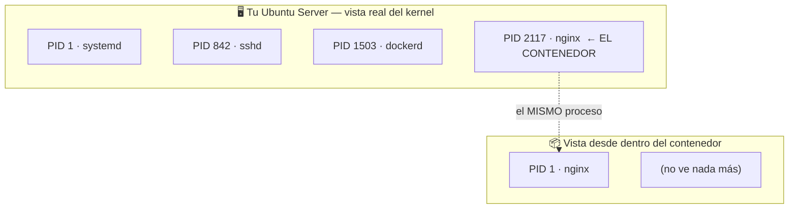

## B6.2.2 — Procesos: `ps aux` dentro y fuera (la demostración)

> [!abstract] Ficha de la práctica
> ### 📌 `B6.2.2` — Procesos dentro y fuera: **la demostración**
> - **Bloque 6** (Aislamiento de servicios) · **Fase B6.2** (Mirar dentro) · **Nivel 2** (Intermedio) · **RA1, RA5** · **CE 1.b, 5.f**
> - **🎬 Playlist:** `B6_Contenedores`
> - **📹 Nombre del vídeo:** `B6.2.2 · Procesos dentro y fuera, la demostración`
> - **Requisito previo:** [[B6_2.1_Entrar_en_un_Contenedor|B6.2.1]].

> [!warning] Esta práctica es distinta a las demás
> No vas a aprender un comando nuevo. Vas a **demostrar con tus propios ojos** la afirmación sobre la que se sostiene todo el bloque:
>
> **un contenedor no es una máquina, es un proceso de tu servidor.**
>
> Te lo dije en B6.0.1 y te pedí que me creyeras. Hoy se comprueba. Si esta práctica te sale bien, el resto del bloque encaja solo.

> [!info] Caso real (contexto profesional)
> El servidor va lento. Ejecutas `htop` y ves un proceso comiéndose la CPU. ¿De qué contenedor es? En una máquina virtual esa pregunta no tiene respuesta desde fuera. **Con contenedores sí**, y eso cambia por completo cómo se diagnostica un servidor.

- **🎯 Objetivo real:** demostrar que el proceso de un contenedor **aparece en la lista de procesos del anfitrión**, con un PID distinto dentro y fuera.
- **🧩 Problema que resuelve:** sin entender esto, los permisos (B6.4) y la red (B6.3) del bloque no tienen sentido.

---

## 📚 Fundamento

> [!info] Espacios de nombres: la venda en los ojos
> El kernel puede darle a un proceso **su propia vista** de ciertos recursos. A eso se le llama *namespace* (espacio de nombres).
>
> El que nos interesa hoy es el **espacio de nombres de procesos**. Dentro de él, el proceso del contenedor:
> - se ve a sí mismo como **PID 1** (el primer proceso, el jefe),
> - y **no ve** ningún otro proceso del servidor.
>
> Pero desde fuera, el kernel lo tiene apuntado con **otro PID**, uno normal, entre los cientos de tu Ubuntu.
>
> **Un proceso. Dos números. Dos puntos de vista.**



> [!warning] El fallo nº1: buscar el proceso con `ps aux` dentro del contenedor
> Ya lo viste en B6.2.1: **`ps` no está instalado** en la imagen de Nginx.
>
> No lo instales para esta práctica. Hay dos formas mejores y que funcionan siempre:
> - **Desde fuera:** `docker top <nombre>` — te lo da el motor, sin necesitar nada dentro.
> - **Desde dentro:** `cat /proc/1/comm` — `/proc` es del kernel y **siempre está ahí**, no es un paquete.

> [!example] Vocabulario de esta práctica
> - **Espacio de nombres (*namespace*):** mecanismo del kernel para dar a un proceso una vista parcial del sistema.
> - **PID:** número que identifica un proceso. **Un contenedor tiene dos: el de dentro y el de fuera.**
> - **PID 1:** el primer proceso. Dentro del contenedor lo es el servicio; fuera lo es `systemd`.
> - **`/proc`:** sistema de archivos virtual del kernel con información de los procesos.
> - **`docker top`:** muestra los procesos de un contenedor **con los PID del anfitrión**.

---

## 📹 Grabación de esta práctica

> [!important] Obligaciones de grabación (LÉEME — es igual en TODAS las prácticas del bloque)
> 1. **Paso 0:** léete el ejercicio y ten a mano OBS y tu identificación. **Crea la entrada de apuntes de esta práctica** en Obsidian: fichero `b6-2-2-procesos-dentro-y-fuera-la-demostracion.md` dentro de `00_Apuntes/Trimestre_N/B6_Contenedores/`, con la estructura de la Fase 0.1 y **vacía**. Rellenarla es cosa tuya, después.
> 2. **Arranca OBS y PRESÉNTATE** mostrando tu identidad (Teams o correo `@alu.edu.gva.es`).
> 3. **Timestamps SIEMPRE:** `00:00 Presentación` y uno por paso.
> 4. **Al terminar:** nombra el vídeo **`B6.2.2 · Procesos dentro y fuera, la demostración`** y súbelo a **`B6_Contenedores`** (No listado). Y **pega su enlace dentro de tu entrada de apuntes**, en el apartado `Enlace al vídeo explicativo`.
> 5. **Una sola entrega.**

---

## 🛠️ Procedimiento

> [!example] Paso 0 — Prepárate y empieza a grabar
> Arranca OBS y preséntate. **Esta práctica se explica en voz alta mientras se hace**: no vale ejecutar comandos en silencio.
> ```bash
> docker run -d --name demo nginx
> docker ps
> ```

> [!example] Paso 1 — Desde tu servidor: ¿existe el proceso?
> ```bash
> ps aux | grep nginx
> ```
> **Ahí está.** En la lista de procesos de tu Ubuntu, como un programa más.
>
> Detente un segundo aquí y dilo en el vídeo: *"esto es un proceso de mi servidor, no una máquina"*.
>
> **Fíjate en que no hay UN proceso, hay CINCO:**
> ```
> root       4673  nginx: master process nginx -g daemon off;
> message+   4718  nginx: worker process
> message+   4719  nginx: worker process
> message+   4720  nginx: worker process
> message+   4721  nginx: worker process
> ```
> Un **master** (de `root`) y varios **workers** (de un usuario sin privilegios) que son los que atienden las peticiones. Es la arquitectura normal de Nginx, la misma que tiene instalado en una máquina.
>
> **Anota el PID del `master process`.** Es el que importa, y en el Paso 5 vas a ver por qué.

> [!example] Paso 2 — Confirma que es del contenedor
> ```bash
> docker top demo
> ```
> Los PID que muestra son **los del anfitrión** — los mismos del Paso 1. El motor te está confirmando la correspondencia.

> [!example] Paso 3 — Ahora el mismo proceso, desde dentro
> ```bash
> docker exec demo cat /proc/1/comm
> docker exec demo ls /proc | head -20
> ```
> Dentro, el proceso principal es **PID 1** y es `nginx`. Y en `/proc` hay **cinco o seis entradas numéricas** (el master y sus workers), no cientos.
>
> **El contraste es la práctica entera:**
>
> | | PID de Nginx | Procesos visibles |
> |---|---|---|
> | Desde el servidor | el que anotaste (p. ej. 2117) | cientos |
> | Desde el contenedor | **1** | cinco o seis |
>
> **Mismo proceso. Dos números. Dos vistas.**

> [!example] Paso 4 — Cuéntalos
> ```bash
> ps aux | wc -l
> docker exec demo ls /proc | grep -c '^[0-9]'
> ```
> Di los dos números en voz alta. La diferencia **es el aislamiento**.

> [!example] Paso 5 — La prueba definitiva: mátalo desde fuera
> **Primero, asegúrate de coger el PID correcto.** Docker te lo da sin margen de error:
> ```bash
> docker inspect --format '{{.State.Pid}}' demo
> ```
> Ese número es **el PID en tu servidor del proceso principal del contenedor** — el `master` del Paso 1, el que dentro es el PID 1. Compáralo con la lista del Paso 1: coincide con el `master process`.
>
> ```bash
> docker ps
> sudo kill -9 $(docker inspect --format '{{.State.Pid}}' demo)
> docker ps
> docker ps -a
> ```
> **El contenedor se ha parado**, y en `docker ps -a` aparece como `Exited (137)`. Ese 137 es la firma de un proceso liquidado con la señal 9 (128 + 9).

> [!warning] Si matas el PID equivocado no pasa nada, y es muy fácil equivocarse
> Si en vez del master matas **un worker**, el contenedor **sigue en marcha**: el master se limita a arrancar otro worker en su lugar, que es justo su trabajo. Compruébalo tú mismo, porque entenderlo vale más que la propia demostración:
> ```bash
> docker run -d --name demo2 nginx
> ps aux | grep "nginx: worker" | head -1        # coge el PID de un worker
> sudo kill -9 <PID_del_worker>
> docker ps                                       # sigue Up
> ps aux | grep "nginx: worker"                   # hay uno nuevo con otro PID
> docker rm -f demo2
> ```
> **Lección:** parar el contenedor equivale a matar **su proceso principal**, no a cualquier proceso que haya dentro. Es exactamente igual que en tu servidor: matar un worker de Apache no tira Apache abajo.
>
> Piensa en lo que acabas de hacer: has apagado un "servidor" con un `kill` desde el sistema anfitrión. **Con una máquina virtual eso es imposible** — sus procesos internos no existen para tu Ubuntu.
>
> Esta es la demostración más contundente del bloque. Explícala en el vídeo.

> [!example] Paso 6 — Compáralo con una máquina virtual
> Si tienes a mano tu VM de Boochan (VirtualBox o Hyper-V), abre `htop` o `ps aux` en el **anfitrión** y busca los procesos de dentro de la VM.
>
> **No están.** Solo verás un proceso `VBoxHeadless` o `vmwp`: la máquina virtual entera es *un* proceso opaco. Lo de dentro es invisible.
>
> Si no la tienes a mano, explícalo razonándolo. Es la comparación que cierra la idea.

> [!example] Paso 7 — Limpia y cierra
> ```bash
> docker rm demo
> docker ps -a
> ```
> Detén OBS, nombra el vídeo **`B6.2.2 · Procesos dentro y fuera, la demostración`**, súbelo a **`B6_Contenedores`** y añade timestamps.

---

## 🚩 Errores y verificación

> [!warning] Errores típicos (evítalos)
> | Error | Qué pasa | Cómo evitarlo |
> | :--- | :--- | :--- |
> | Usar `ps aux` dentro del contenedor | `command not found` | Usa `docker top` fuera o `/proc/1/comm` dentro. |
> | Instalar `procps` dentro para esta práctica | Ensucias la demostración | No hace falta: `/proc` siempre está. |
> | Confundir el PID de dentro con el de fuera | No se entiende la demostración | Anótalos los dos y compáralos. |
> | Hacer `kill` a un **worker** en vez de al master | El contenedor sigue `Up` y la demostración no sale | Coge el PID con `docker inspect --format '{{.State.Pid}}'`. |
> | Hacer `kill` de un PID ajeno al contenedor | Matas otro servicio del servidor | Verifícalo antes con `docker top` o `docker inspect`. |
> | Ejecutar en silencio | La práctica pierde todo su valor | **Hay que explicarla en voz alta.** |

> [!success] ✅ Verificación: ¿está bien hecho?
> - Has localizado el proceso del contenedor en `ps aux` **de tu servidor**.
> - Tienes anotados **los dos PID** (dentro y fuera) y sabes por qué son distintos.
> - Has parado el contenedor con un `kill` **al PID del proceso principal** desde el anfitrión, y sale `Exited (137)`.
> - Has comprobado que matar **un worker** NO para el contenedor, y sabes explicar por qué.
> - Sabes explicar por qué con una máquina virtual esto no se puede hacer.

> [!question] Comprueba que lo has entendido
> 1. ¿Por qué el mismo proceso tiene dos PID distintos? ¿Cuál es "el de verdad"?
> 2. ¿Qué es un espacio de nombres y qué le oculta al contenedor?
> 3. Has parado el contenedor con `kill` al proceso principal desde el anfitrión. Explica por qué eso demuestra que **no es una máquina**.
> 3b. Mataste antes un *worker* y el contenedor siguió vivo. ¿Qué te dice eso sobre qué significa exactamente "parar un contenedor"?
> 4. ¿Por qué dentro del contenedor solo se ven cinco o seis procesos, y de quién son?
> 5. Repite el razonamiento con una máquina virtual: ¿qué verías desde el anfitrión y por qué?
> 6. Vuelve a leer la definición de B6.0.1: *"un proceso al que el kernel le ha puesto vendas en los ojos"*. Explica qué has visto hoy que lo confirma.

---

## ✅ Entregables y cierre

- **Entregable:** en el vídeo, la comparación de los dos PID, el recuento de procesos dentro y fuera, y **el `kill` desde el anfitrión parando el contenedor**, todo explicado en voz alta.
- **Entregable vídeo:** `B6.2.2 · Procesos dentro y fuera, la demostración` en `B6_Contenedores`. **Una sola entrega.**
- **Criterio de éxito:** demostrar y **saber explicar** que un contenedor es un proceso del anfitrión.
- **Entregable apuntes:** `b6-2-2-procesos-dentro-y-fuera-la-demostracion.md` en `B6_Contenedores/`, con la estructura completa, las **respuestas a las preguntas de «Comprueba que lo has entendido»** y el **enlace del vídeo** dentro. Subida al repo con `git add` → `commit` → `push`.

> [!danger] ⚠️ Las respuestas van en la ENTRADA, no sueltas
> Las preguntas de esta práctica no son decorativas: son lo que demuestra que has entendido lo que hiciste, y no solo que supiste seguir los pasos. Se contestan **con tus palabras** en el apartado `Respuesta a las preguntas` de tu entrada.
> Una práctica con el vídeo perfecto y las preguntas en blanco está **incompleta**.

> [!summary] 🎓 Qué has aprendido en este ejercicio
> - Que el proceso de un contenedor **está en la lista de procesos de tu servidor**.
> - Que tiene **dos PID**: el 1 desde dentro, uno normal desde fuera. Un proceso, dos vistas.
> - Que los **espacios de nombres** del kernel son el mecanismo del aislamiento.
> - Que puedes **matar un contenedor con `kill`** desde el anfitrión — imposible con una VM.
> - Que la definición del primer día era literal, no una metáfora.
>
> **Siguiente:** [[B6_2.3_El_Contenedor_es_Efimero|B6.2.3 — El contenedor es efímero: escribe, borra, desaparece]].
