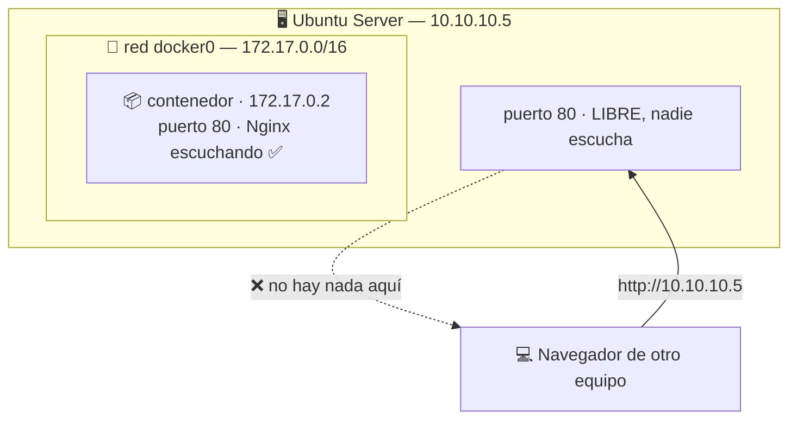

## B6.3.1 — Nginx sin `-p`: por qué no responde

> [!abstract] Ficha de la práctica
> ### 📌 `B6.3.1` — Nginx sin `-p`: por qué no responde
> - **Bloque 6** (Aislamiento de servicios) · **Fase B6.3** (Red y puertos) · **Nivel 1** (Básico) · **RA1** · **CE 1.i**
> - **🎬 Playlist:** `B6_Contenedores`
> - **📹 Nombre del vídeo:** `B6.3.1 · Nginx sin publicar, por qué no responde`
> - **Requisito previo:** Fase B6.2 completa.

> [!info] Caso real (contexto profesional)
> *"He levantado el servidor web en el contenedor, dice que está `Up`, pero desde mi navegador no carga nada. ¿Está roto?"* Es, con diferencia, la pregunta más repetida de quien empieza con contenedores.
>
> **No está roto.** Y hoy vas a entender exactamente por qué, en vez de copiar la solución de un foro.

- **🎯 Objetivo real:** comprobar que un contenedor tiene **su propia red y su propia IP**, y que sus puertos no son los de tu servidor.
- **🧩 Problema que resuelve:** sin entender esto, publicar puertos (B6.3.2) es magia copiada, y diagnosticar un servicio inaccesible es imposible.

---

## 📚 Fundamento

> [!info] Otro espacio de nombres, ahora el de red
> En B6.2.2 viste que el kernel le oculta al contenedor los procesos del sistema. **Hace lo mismo con la red.**
>
> El contenedor recibe:
> - su propia **interfaz de red**,
> - su propia **dirección IP** (normalmente `172.17.0.x`),
> - y sus propios **65535 puertos**, independientes de los de tu servidor.
>
> Así que cuando Nginx "escucha en el puerto 80", escucha en **el puerto 80 del contenedor**, no en el de tu Ubuntu. Son dos puertos 80 distintos que no tienen nada que ver.



> [!warning] El fallo nº1: pensar que el contenedor "no funciona"
> Nginx **está funcionando perfectamente**. Lo que pasa es que nadie ha construido el puente entre el puerto del servidor y el del contenedor.
>
> **La regla de diagnóstico:** si un servicio en contenedor no responde, antes de tocar el servicio comprueba **si has publicado el puerto**. En nueve de cada diez casos es eso.

> [!example] Vocabulario de esta práctica
> - **Espacio de nombres de red:** la vista de red propia del contenedor.
> - **`docker0`:** puente virtual que Docker crea en tu servidor para conectar contenedores.
> - **IP del contenedor:** `172.17.0.x` por defecto. **Interna**: no la ve nadie fuera del servidor.
> - **Publicar un puerto:** abrir el paso entre un puerto del anfitrión y uno del contenedor. Es `-p`, y es la práctica siguiente.
> - **`curl`:** cliente de línea de comandos para probar servicios web sin navegador.

---

## 📹 Grabación de esta práctica

> [!important] Obligaciones de grabación (LÉEME — es igual en TODAS las prácticas del bloque)
> 1. **Paso 0:** léete el ejercicio y ten a mano OBS y tu identificación.
> 2. **Arranca OBS y PRESÉNTATE** mostrando tu identidad (Teams o correo `@alu.edu.gva.es`).
> 3. **Timestamps SIEMPRE:** `00:00 Presentación` y uno por paso.
> 4. **Al terminar:** nombra el vídeo **`B6.3.1 · Nginx sin publicar, por qué no responde`** y súbelo a **`B6_Contenedores`** (No listado).
> 5. **Una sola entrega.**

---

## 🛠️ Procedimiento

> [!example] Paso 0 — Prepárate y empieza a grabar
> Arranca OBS y preséntate. Instala `curl` si no lo tienes: `sudo apt install -y curl`.
> ```bash
> docker run -d --name webred nginx
> docker ps
> ```
> Fíjate en la columna `PORTS`: dice `80/tcp` **a secas**. Guárdate ese detalle.

> [!example] Paso 1 — Intenta acceder como lo haría cualquiera
> ```bash
> curl http://localhost
> ```
> **`Connection refused`.** El contenedor está `Up` y el servicio no responde. Aquí es donde la mayoría se rinde.

> [!example] Paso 2 — Comprueba que en tu servidor no escucha nadie
> ```bash
> sudo ss -tlnp | grep ':80'
> ```
> **Vacío.** No es que Nginx falle: es que **en el puerto 80 de tu Ubuntu no hay absolutamente nada**.

> [!example] Paso 3 — Averigua la IP del contenedor
> ```bash
> docker inspect -f '{{range .NetworkSettings.Networks}}{{.IPAddress}}{{end}}' webred
> ```
> Te devuelve algo como `172.17.0.2`. **Ese contenedor tiene su propia dirección IP.**

> [!example] Paso 4 — Y ahora la prueba clave
> ```bash
> curl http://172.17.0.2
> ```
> *(sustituye por la IP que te haya salido)*
>
> **¡Responde!** Sale el HTML de la página por defecto de Nginx.
>
> **Nginx funcionaba desde el principio.** Simplemente escuchaba en un sitio al que nadie estaba llamando.

> [!example] Paso 5 — Míralo desde dentro
> ```bash
> docker exec webred cat /proc/net/tcp | head -3
> docker exec webred hostname -i
> ```
> Desde dentro, el contenedor se ve a sí mismo con esa IP. **Cree que es una máquina en la red.**

> [!example] Paso 6 — Comprueba el puente `docker0`
> ```bash
> ip addr show docker0
> ip route | grep 172.17
> ```
> Ahí está la interfaz que Docker creó en tu servidor. Tu Ubuntu **es el router** de esa red interna, y por eso el `curl` del Paso 4 funcionó desde aquí.

> [!example] Paso 7 — La prueba que lo cierra: desde otro equipo
> Desde tu **cliente Windows** (o cualquier otra máquina de la red), abre el navegador o PowerShell:
> ```powershell
> curl http://IP_DE_TU_SERVIDOR
> ```
> **No responde.** Y `http://172.17.0.2` tampoco, porque esa red **solo existe dentro de tu servidor**.
>
> Conclusión para el vídeo: *"el servicio funciona, pero solo es accesible desde el propio servidor. Para el resto de la red no existe."*

> [!example] Paso 8 — Limpia y cierra
> ```bash
> docker rm -f webred
> ```
> Detén OBS, nombra el vídeo **`B6.3.1 · Nginx sin publicar, por qué no responde`**, súbelo a **`B6_Contenedores`** y añade timestamps.

---

## 🚩 Errores y verificación

> [!warning] Errores típicos (evítalos)
> | Error | Qué pasa | Cómo evitarlo |
> | :--- | :--- | :--- |
> | Concluir que el contenedor está roto | Se reinstala Nginx sin motivo | Comprueba primero si el puerto está publicado. |
> | Confundir `80/tcp` con puerto publicado | Se cree que ya está accesible | Publicado se ve como `0.0.0.0:8080->80/tcp`. |
> | Usar la IP `172.17.0.x` desde otro equipo | No responde nunca | Es una red **interna del servidor**. |
> | Tocar la configuración de Nginx | Se rompe algo que funcionaba | El problema no está en el servicio. |
> | Abrir el puerto en el firewall creyendo que es eso | No cambia nada | No hay nada escuchando que abrir. |

> [!success] ✅ Verificación: ¿está bien hecho?
> - `curl http://localhost` da `Connection refused`.
> - `ss -tlnp | grep ':80'` sale **vacío**.
> - `curl http://<IP_del_contenedor>` **sí responde** desde el servidor.
> - Desde otro equipo de la red **no responde** por ninguna de las dos vías.
> - Sabes explicar por qué sin usar la palabra "roto".

> [!question] Comprueba que lo has entendido
> 1. El contenedor está `Up` y `curl localhost` falla. ¿Por qué no es un fallo del servicio?
> 2. ¿Qué significa exactamente que `ss -tlnp` no muestre nada en el puerto 80?
> 3. ¿Por qué `curl http://172.17.0.2` funciona desde el servidor pero no desde el cliente Windows?
> 4. ¿Qué es `docker0` y qué papel juega tu Ubuntu en esa red?
> 5. Un compañero abre el puerto 80 en el firewall para arreglarlo. ¿Funcionará? Razónalo.
> 6. Relaciona lo de hoy con lo que viste en B6.2.2 sobre los espacios de nombres. ¿Qué tienen en común?

---

## ✅ Entregables y cierre

- **Entregable:** en el vídeo, el `Connection refused` en `localhost`, el `ss` vacío, y **el mismo servicio respondiendo por su IP interna**.
- **Entregable vídeo:** `B6.3.1 · Nginx sin publicar, por qué no responde` en `B6_Contenedores`. **Una sola entrega.**
- **Criterio de éxito:** demostrar que el servicio funciona y explicar por qué es inaccesible, sin tocarlo.

> [!summary] 🎓 Qué has aprendido en este ejercicio
> - Que un contenedor tiene **su propia red, su propia IP y sus propios puertos**.
> - Que "el puerto 80 del contenedor" y "el puerto 80 del servidor" **son dos puertos distintos**.
> - Que un servicio inaccesible casi nunca está roto: **falta publicar el puerto**.
> - Que la red `172.17.0.x` es **interna** y no existe para el resto de tu red.
>
> **Siguiente:** [[B6_3.2_Publicar_Puertos|B6.3.2 — Publicar puertos con `-p 8080:80`]], donde construyes el puente que falta.
