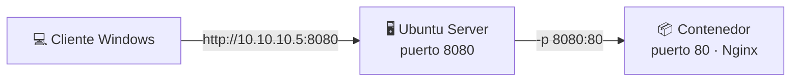

## B6.3.2 — Publicar puertos con `-p 8080:80`

> [!abstract] Ficha de la práctica
> ### 📌 `B6.3.2` — Publicar puertos con `-p 8080:80`
> - **Bloque 6** (Aislamiento de servicios) · **Fase B6.3** (Red y puertos) · **Nivel 2** (Intermedio) · **RA1** · **CE 1.i**
> - **🎬 Playlist:** `B6_Contenedores`
> - **📹 Nombre del vídeo:** `B6.3.2 · Publicar puertos con -p`
> - **Requisito previo:** [[B6_3.1_Nginx_sin_Publicar|B6.3.1]].

> [!info] Caso real (contexto profesional)
> La empresa necesita que el servicio web del contenedor sea accesible desde los equipos del aula. El servidor ya tiene otras cosas escuchando en el 80, así que el servicio nuevo tiene que salir por otro puerto. Publicar puertos —y elegir bien cuál— es la tarea que convierte un contenedor aislado en **un servicio de red de verdad**.

- **🎯 Objetivo real:** publicar el puerto de un contenedor y comprobar el acceso **desde otro equipo de la red**.
- **🧩 Problema que resuelve:** es el paso que faltaba en B6.3.1 para que el servicio exista para el resto del mundo.

---

## 📚 Fundamento

> [!info] `-p` construye un puente
> `-p` le dice a Docker: *"lo que llegue a este puerto de mi servidor, redirígelo a este otro del contenedor"*.
>
> ```
> -p 8080:80
>    ▲    ▲
>    │    └── puerto DENTRO del contenedor (donde escucha el servicio)
>    └─────── puerto EN TU SERVIDOR (por donde entra la gente)
> ```
>
> **Siempre `ANFITRIÓN:CONTENEDOR`.** De fuera hacia dentro, igual que se lee una dirección.



> [!warning] El fallo nº1: invertir el orden
> Escribir `-p 80:8080` cuando querías `-p 8080:80`. El contenedor arranca **sin dar error** —Docker no sabe qué pretendías— y luego nada responde. Puedes perder media hora ahí.
>
> **Truco para no fallar nunca:** el número de la derecha es el que el servicio trae de fábrica y **no eliges tú** (Nginx 80, PostgreSQL 5432, MySQL 3306). El de la izquierda lo eliges tú. Si el de la derecha no es el "de fábrica", lo tienes al revés.

> [!example] Vocabulario de esta práctica
> - **Publicar (*publish*):** abrir el paso de un puerto del anfitrión a uno del contenedor.
> - **`-p ANFITRIÓN:CONTENEDOR`:** la sintaxis. El orden importa.
> - **`0.0.0.0:8080->80/tcp`:** lo que muestra `docker ps` cuando está publicado.
> - **`0.0.0.0`:** escucha en **todas** las interfaces del servidor.
> - **`127.0.0.1:8080:80`:** publica **solo** para el propio servidor. Más seguro.
> - **`-P` (mayúscula):** publica todos los puertos en puertos aleatorios. Poco recomendable.

---

## 📹 Grabación de esta práctica

> [!important] Obligaciones de grabación (LÉEME — es igual en TODAS las prácticas del bloque)
> 1. **Paso 0:** léete el ejercicio y ten a mano OBS y tu identificación. **Crea la entrada de apuntes de esta práctica** en Obsidian: fichero `b6-3-2-publicar-puertos-con-p.md` dentro de `00_Apuntes/Trimestre_N/B6_Contenedores/`, con la estructura de la Fase 0.1 y **vacía**. Rellenarla es cosa tuya, después.
> 2. **Arranca OBS y PRESÉNTATE** mostrando tu identidad (Teams o correo `@alu.edu.gva.es`).
> 3. **Timestamps SIEMPRE:** `00:00 Presentación` y uno por paso.
> 4. **Al terminar:** nombra el vídeo **`B6.3.2 · Publicar puertos con -p`** y súbelo a **`B6_Contenedores`** (No listado). Y **pega su enlace dentro de tu entrada de apuntes**, en el apartado `Enlace al vídeo explicativo`.
> 5. **Una sola entrega.**

---

## 🛠️ Procedimiento

> [!example] Paso 0 — Prepárate y empieza a grabar
> Arranca OBS y preséntate. Ten a mano la **IP de tu servidor** (`ip a`) y el cliente Windows encendido.

> [!example] Paso 1 — Ahora sí, publica
> ```bash
> docker run -d --name webpub -p 8080:80 nginx
> docker ps
> ```
> Mira la columna `PORTS`: ahora dice **`0.0.0.0:8080->80/tcp`**. Compáralo con el `80/tcp` a secas de B6.3.1. **Esa flecha es el puente.**

> [!example] Paso 2 — Prueba desde el servidor
> ```bash
> curl http://localhost:8080
> ```
> **Responde.** Mismo contenedor que ayer, misma imagen, misma configuración de Nginx. Lo único que ha cambiado es `-p`.

> [!example] Paso 3 — Comprueba quién escucha ahora
> ```bash
> sudo ss -tlnp | grep 8080
> ```
> Ahora **sí** aparece algo. Fíjate en el proceso: `docker-proxy` o el propio `dockerd`. **Es Docker quien escucha en tu servidor**, no Nginx, y le pasa el tráfico al contenedor.

> [!example] Paso 4 — La prueba de verdad: desde el cliente Windows
> En tu cliente Windows 11, en el navegador:
> ```
> http://IP_DE_TU_SERVIDOR:8080
> ```
> **Debe salir la página de Nginx.** Si no sale, mira el firewall (Paso 5).
>
> **Grábalo.** Este es el entregable de la práctica: el servicio del contenedor visto desde otro equipo de la red.

> [!example] Paso 5 — Si no responde: el firewall
> ```bash
> sudo ufw status
> sudo ufw allow 8080/tcp
> ```
> Publicar el puerto abre el paso **Docker → contenedor**, pero el cortafuegos del servidor sigue siendo el portero de la puerta de la calle. Son dos cosas distintas, y hay que resolver las dos.

> [!example] Paso 6 — Cambia el puerto público sin tocar el servicio
> ```bash
> docker rm -f webpub
> docker run -d --name webpub -p 9090:80 nginx
> curl http://localhost:9090
> curl http://localhost:8080
> ```
> El primero responde, el segundo no. **El servicio no ha cambiado nada**: sigue escuchando en su puerto 80 interno. Solo has movido la puerta de entrada.
>
> Esta es la gran ventaja: puedes tener diez servicios distintos, todos escuchando internamente en el 80, y publicarlos en diez puertos diferentes.

> [!example] Paso 7 — Provoca el error del orden invertido
> ```bash
> docker rm -f webpub
> docker run -d --name webmal -p 80:8080 nginx
> docker ps
> curl http://localhost:80
> ```
> **Arranca sin quejarse y no responde.** Docker ha hecho exactamente lo que le pediste: redirigir el 80 de tu servidor al **8080 del contenedor**, donde no hay nada escuchando.
>
> Explica el fallo en el vídeo. **Cometerlo a propósito ahora es la mejor vacuna.**

> [!example] Paso 8 — Publicación restringida al servidor
> ```bash
> docker rm -f webmal
> docker run -d --name weblocal -p 127.0.0.1:8080:80 nginx
> curl http://localhost:8080
> ```
> Funciona desde el servidor. Pruébalo desde el cliente Windows: **no responde**.
>
> Es lo que se usa para servicios que solo debe consumir el propio servidor (una base de datos detrás de una web, por ejemplo). **Menos superficie expuesta, más seguridad.**

> [!example] Paso 9 — Limpia y cierra
> ```bash
> docker rm -f weblocal
> docker ps -a
> ```
> Detén OBS, nombra el vídeo **`B6.3.2 · Publicar puertos con -p`**, súbelo a **`B6_Contenedores`** y añade timestamps.

---

## 🚩 Errores y verificación

> [!warning] Errores típicos (evítalos)
> | Error | Qué pasa | Cómo evitarlo |
> | :--- | :--- | :--- |
> | Invertir el orden (`-p 80:8080`) | Arranca sin error y no responde | **`ANFITRIÓN:CONTENEDOR`.** El de la derecha es el de fábrica. |
> | Olvidar el firewall | Funciona en local, no desde el cliente | `sudo ufw allow <puerto>/tcp`. |
> | Publicar en un puerto ya ocupado | *"port is already allocated"* | Elige otro (es la práctica B6.3.3). |
> | Cambiar el puerto interno del servicio | Se complica sin necesidad | Deja el interno de fábrica y cambia solo el externo. |
> | Publicar en `0.0.0.0` una base de datos | La expones a toda la red | Usa `127.0.0.1:puerto:puerto`. |
> | Usar `-P` mayúscula | Puertos aleatorios imposibles de documentar | Usa `-p` y elige tú. |

> [!success] ✅ Verificación: ¿está bien hecho?
> - `docker ps` muestra `0.0.0.0:8080->80/tcp`.
> - `curl http://localhost:8080` responde desde el servidor.
> - **La página se ve desde el cliente Windows** por `http://IP:8080`.
> - Has provocado y explicado el fallo del orden invertido.
> - `127.0.0.1:8080:80` funciona en local y **no** desde el cliente.

> [!question] Comprueba que lo has entendido
> 1. Explica qué significa cada número en `-p 8080:80` y en qué orden van.
> 2. En `ss -tlnp` aparece `docker-proxy`, no `nginx`. ¿Por qué?
> 3. Publicas el puerto y desde el cliente Windows sigue sin verse. ¿Qué compruebas y en qué orden?
> 4. ¿Qué diferencia hay entre `-p 8080:80` y `-p 127.0.0.1:8080:80`? ¿Cuándo usarías cada uno?
> 5. Quieres levantar tres servicios web a la vez en el mismo servidor. ¿Qué puertos les pones y por qué no hace falta tocar su configuración interna?
> 6. Un compañero pone `-p 3306:80` para un MySQL. ¿Qué le pasa y por qué?

---

## ✅ Entregables y cierre

- **Entregable:** en el vídeo, la página de Nginx **cargada desde el cliente Windows** por `http://IP_SERVIDOR:8080`, más el fallo intencionado del orden invertido.
- **Entregable vídeo:** `B6.3.2 · Publicar puertos con -p` en `B6_Contenedores`. **Una sola entrega.**
- **Criterio de éxito:** servicio accesible desde otro equipo + dominio de la sintaxis `ANFITRIÓN:CONTENEDOR`.
- **Entregable apuntes:** `b6-3-2-publicar-puertos-con-p.md` en `B6_Contenedores/`, con la estructura completa, las **respuestas a las preguntas de «Comprueba que lo has entendido»** y el **enlace del vídeo** dentro. Subida al repo con `git add` → `commit` → `push`.

> [!danger] ⚠️ Las respuestas van en la ENTRADA, no sueltas
> Las preguntas de esta práctica no son decorativas: son lo que demuestra que has entendido lo que hiciste, y no solo que supiste seguir los pasos. Se contestan **con tus palabras** en el apartado `Respuesta a las preguntas` de tu entrada.
> Una práctica con el vídeo perfecto y las preguntas en blanco está **incompleta**.

> [!summary] 🎓 Qué has aprendido en este ejercicio
> - Que `-p` construye el **puente** entre un puerto de tu servidor y uno del contenedor.
> - Que el orden es **`ANFITRIÓN:CONTENEDOR`** y que invertirlo no da error, solo silencio.
> - Que quien escucha en tu servidor es **Docker**, no el servicio.
> - Que publicar y **abrir el firewall** son dos cosas distintas: hacen falta las dos.
> - Que `127.0.0.1:` restringe la publicación al propio servidor, y eso es una decisión de seguridad.
>
> **Siguiente:** [[B6_3.3_Conflictos_de_Puerto|B6.3.3 — Varios contenedores a la vez y conflictos de puerto]].
