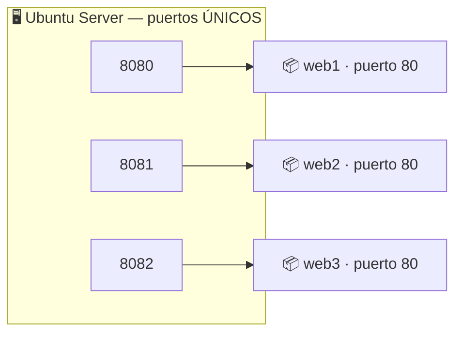

## B6.3.3 — Varios contenedores a la vez y conflictos de puerto

> [!abstract] Ficha de la práctica
> ### 📌 `B6.3.3` — Varios contenedores a la vez y conflictos de puerto
> - **Bloque 6** (Aislamiento de servicios) · **Fase B6.3** (Red y puertos) · **Nivel 2** (Intermedio) · **RA.01** · **CE.01.e · CE.01.i**
> - **🎬 Playlist:** `B6_Contenedores`
> - **📹 Nombre del vídeo:** `B6.3.3 · Varios contenedores y conflictos de puerto`
> - **Requisito previo:** [[B6_3.2_Publicar_Puertos|B6.3.2]].

> [!info] Caso real (contexto profesional)
> En el servidor conviven la intranet, la aplicación de gestión y un entorno de pruebas. Los tres son servidores web y los tres escuchan internamente en el puerto 80. Con máquinas virtuales harían falta tres máquinas. **Con contenedores caben los tres en el mismo servidor** — pero solo si sabes repartir los puertos del anfitrión.

- **🎯 Objetivo real:** levantar varios servicios idénticos a la vez, provocar un conflicto de puerto y resolverlo entendiendo por qué ocurre.
- **🧩 Problema que resuelve:** es la situación normal de cualquier servidor real con contenedores.

---

## 📚 Fundamento

> [!info] El recurso escaso es el puerto del anfitrión
> Cada contenedor tiene **su propio juego completo de puertos**. Diez contenedores pueden usar el puerto 80 a la vez sin molestarse, porque son diez puertos 80 distintos, en diez espacios de red distintos.
>
> **Lo que no se puede repetir es el puerto del anfitrión**, porque ahí solo hay un juego de puertos: los de tu Ubuntu.
>
> ```
> ✅ -p 8080:80  +  -p 8081:80  +  -p 8082:80     ← tres puertos anfitrión distintos
> ❌ -p 8080:80  +  -p 8080:80                    ← el 8080 del anfitrión ya está pillado
> ```



> [!warning] El fallo nº1: cambiar el puerto interno del servicio
> Cuando aparece el conflicto, mucha gente entra en el contenedor a reconfigurar Nginx para que escuche en el 8081. **Es trabajo perdido y además rompe la portabilidad de la imagen.**
>
> El interno se deja como viene de fábrica **siempre**. Lo que se cambia es el externo, que es tuyo y no le importa a nadie más. Un contenedor que necesita reconfiguración interna para convivir con otro es un contenedor mal usado.

> [!example] Vocabulario de esta práctica
> - **Conflicto de puerto:** dos contenedores intentando publicar en el mismo puerto del anfitrión.
> - **`port is already allocated`:** el mensaje exacto. Aprende a reconocerlo.
> - **Puerto interno:** el del servicio, de fábrica. **No se toca.**
> - **Puerto publicado:** el del anfitrión. Lo eliges tú y es único.
> - **Contenedor `Created`:** se creó pero no llegó a arrancar. Queda ahí ocupando sitio.

---

## 📹 Grabación de esta práctica

> [!important] Obligaciones de grabación (LÉEME — es igual en TODAS las prácticas del bloque)
> 1. **Paso 0:** léete el ejercicio y ten a mano OBS y tu identificación. **Crea la entrada de apuntes de esta práctica** en Obsidian: fichero `b6-3.3-varios-contenedores-y-conflictos-de-puerto.md` dentro de `00_Apuntes/Trimestre_N/B6_Contenedores/`, con la estructura del **Bloque 0 · Fase 0.1.b** y **vacía**. Rellenarla es cosa tuya, después.
> 2. **Arranca OBS y PRESÉNTATE** mostrando tu identidad (Teams o correo `@alu.edu.gva.es`).
> 3. **Timestamps SIEMPRE:** `00:00 Presentación` y uno por paso.
> 4. **Al terminar:** nombra el vídeo **`B6.3.3 · Varios contenedores y conflictos de puerto`** y súbelo a **`B6_Contenedores`** (No listado). Y **pega su enlace dentro de tu entrada de apuntes**, en el apartado `Enlace al vídeo explicativo`.
> 5. **Se graba una sola vez** (no se duplica casa/centro). **La entrega va por la TAREA de Teams:** abriré una tarea que cubrirá **esta práctica y otras**; te llegará notificación con fecha límite. Ahí pegarás el enlace de tu **repositorio de apuntes** — los vídeos ya están dentro de tus entradas.

---

## 🛠️ Procedimiento

> [!example] Paso 0 — Prepárate y empieza a grabar
> Arranca OBS y preséntate. Parte de un sistema limpio: `docker ps -a`.

> [!example] Paso 1 — Levanta el primero
> ```bash
> docker run -d --name web1 -p 8080:80 nginx
> curl -s http://localhost:8080 | grep -i title
> ```

> [!example] Paso 2 — Provoca el conflicto
> ```bash
> docker run -d --name web2 -p 8080:80 nginx
> ```
> **Error:** `Bind for 0.0.0.0:8080 failed: port is already allocated`.
>
> Lee el mensaje entero en el vídeo. **Docker te está diciendo exactamente lo que pasa**, y saber leer errores es media asignatura.

> [!example] Paso 3 — El rastro que deja el fallo
> ```bash
> docker ps -a
> ```
> Ahí está `web2` en estado **`Created`**: se creó pero no arrancó. **Ocupa el nombre** y te impedirá reutilizarlo. Límpialo:
> ```bash
> docker rm web2
> ```
> Este detalle explica muchos *"pero si ya lo he borrado"* de compañeros que solo miraron `docker ps`.

> [!example] Paso 4 — La solución correcta
> ```bash
> docker run -d --name web2 -p 8081:80 nginx
> docker run -d --name web3 -p 8082:80 nginx
> docker ps
> ```
> **Tres contenedores, tres puertos de anfitrión, el mismo puerto 80 interno en los tres.**

> [!example] Paso 5 — Demuestra que son servicios distintos
> Personaliza cada uno para que se distingan:
> ```bash
> docker exec web1 bash -c 'echo "<h1>WEB 1 - Intranet</h1>" > /usr/share/nginx/html/index.html'
> docker exec web2 bash -c 'echo "<h1>WEB 2 - Gestion</h1>" > /usr/share/nginx/html/index.html'
> docker exec web3 bash -c 'echo "<h1>WEB 3 - Pruebas</h1>" > /usr/share/nginx/html/index.html'
> curl -s http://localhost:8080
> curl -s http://localhost:8081
> curl -s http://localhost:8082
> ```
> **Tres respuestas distintas.** Compruébalo también desde el cliente Windows con los tres puertos: es el entregable.

> [!example] Paso 6 — Verifica los puertos internos
> ```bash
> docker exec web1 grep -r "listen" /etc/nginx/conf.d/default.conf
> docker exec web2 grep -r "listen" /etc/nginx/conf.d/default.conf
> ```
> **Los dos dicen `listen 80`.** Ninguna configuración se ha tocado. Toda la convivencia se resolvió desde fuera.

> [!example] Paso 7 — Mira el reparto desde el servidor
> ```bash
> sudo ss -tlnp | grep -E '808[0-2]'
> docker ps --format "table {{.Names}}\t{{.Ports}}"
> ```
> Los tres puertos ocupados, cada uno apuntando a su contenedor. **Esta es la foto de un servidor real con contenedores.**

> [!example] Paso 8 — Un conflicto más sutil
> ```bash
> sudo ss -tlnp | grep ':22'
> docker run -d --name malaidea -p 22:80 nginx
> ```
> Si el SSH de tu servidor está en el 22, fallará. Y **si no fallara sería peor**: estarías secuestrando el puerto de administración del servidor.
>
> **Regla práctica:** para contenedores, usa puertos altos (8000-9000). Los bajos son del sistema.
> ```bash
> docker rm malaidea 2>/dev/null
> ```

> [!example] Paso 9 — Limpia y cierra
> ```bash
> docker rm -f web1 web2 web3
> docker ps -a
> ```
> Detén OBS, nombra el vídeo **`B6.3.3 · Varios contenedores y conflictos de puerto`**, súbelo a **`B6_Contenedores`** y añade timestamps.

---

## 🚩 Errores y verificación

> [!warning] Errores típicos (evítalos)
> | Error | Qué pasa | Cómo evitarlo |
> | :--- | :--- | :--- |
> | Reconfigurar el puerto interno del servicio | Trabajo perdido y pierdes portabilidad | Cambia solo el **externo**. |
> | No borrar el contenedor `Created` que falló | *"name is already in use"* al reintentar | `docker ps -a` y `docker rm`. |
> | Usar puertos bajos (22, 80, 443) | Chocas con servicios del sistema | Usa el rango 8000-9000. |
> | Creer que dos contenedores no pueden usar el 80 | Se complica la solución sin motivo | Internamente **sí pueden**: son redes distintas. |
> | No documentar qué puerto es de qué | Nadie sabe qué es qué a los dos meses | `docker ps --format` y anótalo. |
> | Abrir el firewall solo para uno de los tres | Dos servicios inaccesibles desde la red | Un `ufw allow` por cada puerto publicado. |

> [!success] ✅ Verificación: ¿está bien hecho?
> - Has visto el error `port is already allocated` y sabes leerlo.
> - Has encontrado y limpiado el contenedor en estado `Created`.
> - **Tres servicios distintos** responden en 8080, 8081 y 8082.
> - Has comprobado que **los tres siguen escuchando en el 80 interno**.
> - Los tres se ven desde el cliente Windows.

> [!question] Comprueba que lo has entendido
> 1. ¿Por qué tres contenedores pueden usar el puerto 80 a la vez pero no el 8080 del anfitrión?
> 2. ¿Qué es el estado `Created` y por qué es un problema si no lo limpias?
> 3. Un compañero entra en el contenedor a cambiar el `listen 80` por `listen 8081`. ¿Qué le dices?
> 4. ¿Por qué se recomienda el rango 8000-9000 para contenedores?
> 5. Tienes que montar cinco entornos de prueba idénticos. Diseña el reparto de puertos y justifícalo.
> 6. ¿Qué habría hecho falta para montar estos tres servicios con máquinas virtuales? Compara el consumo.

---

## ✅ Entregables y cierre

- **Entregable:** en el vídeo, el error de conflicto, su resolución, y **los tres servicios respondiendo con contenido distinto** desde el cliente Windows.
- **Entregable vídeo:** `B6.3.3 · Varios contenedores y conflictos de puerto` en `B6_Contenedores`. **Se graba una sola vez** (no se duplica casa/centro). **La entrega va por la TAREA de Teams:** abriré una tarea que cubrirá **esta práctica y otras**; te llegará notificación con fecha límite. Ahí pegarás el enlace de tu **repositorio de apuntes** — los vídeos ya están dentro de tus entradas.
- **Criterio de éxito:** tres servicios conviviendo + saber que el interno no se toca.
- **Entregable apuntes:** `b6-3.3-varios-contenedores-y-conflictos-de-puerto.md` en `B6_Contenedores/`, con la estructura completa, las **respuestas a las preguntas de «Comprueba que lo has entendido»** y el **enlace del vídeo** dentro. Subida al repo con `git add` → `commit` → `push`.

> [!danger] ⚠️ Las respuestas van en la ENTRADA, no sueltas
> Las preguntas de esta práctica no son decorativas: son lo que demuestra que has entendido lo que hiciste, y no solo que supiste seguir los pasos. Se contestan **con tus palabras** en el apartado `Respuesta a las preguntas` de tu entrada.
> Una práctica con el vídeo perfecto y las preguntas en blanco está **incompleta**.

> [!summary] 🎓 Qué has aprendido en este ejercicio
> - Que el recurso escaso es **el puerto del anfitrión**, no el del contenedor.
> - Que `port is already allocated` deja un contenedor en `Created` que **hay que limpiar**.
> - Que **el puerto interno no se toca nunca**: la convivencia se resuelve desde fuera.
> - Que un servidor con contenedores es un **reparto de puertos**, y hay que documentarlo.
>
> ---
>
> **Con esto se cierra la Fase B6.3.** Tus contenedores ya son servicios de red accesibles.
>
> **Siguiente:** [[B6_4.1_Volumenes|B6.4.1 — Volúmenes: que los datos sobrevivan al contenedor]]. Entramos en **el corazón del bloque**.
