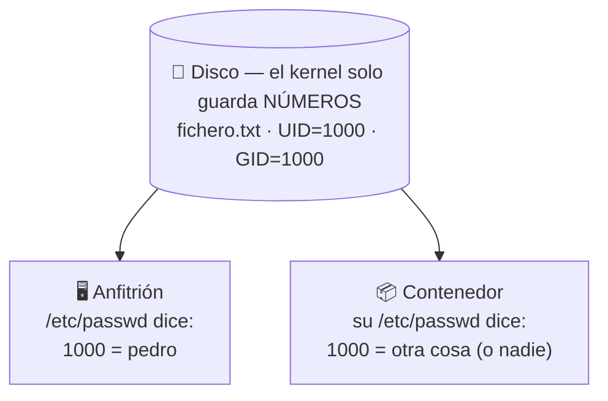

## B6.4.3 — El choque de UID/GID: reencuentro con UD05

> [!abstract] Ficha de la práctica
> ### 📌 `B6.4.3` — El choque de UID/GID
> - **Bloque 6** (Aislamiento de servicios) · **Fase B6.4** (Persistencia y permisos) · **Nivel 3** (Avanzado) · **RA.04** · **CE.04.a · CE.04.c**
> - **🎬 Playlist:** `B6_Contenedores`
> - **📹 Nombre del vídeo:** `B6.4.3 · El choque de UID y GID`
> - **Requisito previo:** [[B6_4.2_Bind_Mount|B6.4.2]] y **UD05** (usuarios, grupos y permisos).

> [!warning] Esta práctica es el motivo por el que este bloque pertenece a SOR
> Hoy no aprendes Docker. Hoy vas a entender **de verdad**, probablemente por primera vez, qué es un permiso en Linux.
>
> Llevas todo el curso haciendo `chmod` y `chown`. Hoy descubres que **un usuario no es un nombre: es un número**, y que los nombres son un adorno que cada sistema se inventa por su cuenta.
>
> Si esta práctica te sale bien, UD05 deja de ser recetas.

> [!info] Caso real (contexto profesional)
> El departamento de comunicación no puede editar los ficheros de la web: *"permiso denegado"*. Nadie ha tocado los permisos. El culpable es un contenedor que escribió en la carpeta compartida y **dejó los ficheros a nombre de root**. Es uno de los problemas más frecuentes y peor entendidos de cualquier servidor con contenedores.

- **🎯 Objetivo real:** provocar, diagnosticar y resolver el choque de identidades entre el usuario del contenedor y el del anfitrión.
- **🧩 Problema que resuelve:** los *bind mounts* de B6.4.2 son inservibles en producción si no dominas esto.

---

## 📚 Fundamento

> [!important] La idea que lo explica todo
> **El kernel no sabe cómo te llamas. Solo conoce números.**
>
> Cuando creas un fichero, el kernel apunta el **UID** (número de usuario) y el **GID** (número de grupo) del que lo creó. Nada más. En el disco no se guarda ningún nombre.
>
> `/etc/passwd` es **solo una tabla de traducción** de número a nombre, para que las personas leamos algo cómodo. Y aquí está la clave:
>
> **El contenedor tiene su propio `/etc/passwd`, distinto del tuyo.**
>
> Así que el mismo número puede llamarse `pedro` en tu servidor y `nadie` (o nada) dentro del contenedor. El fichero es el mismo. El número es el mismo. **El nombre no.**



> [!warning] El fallo nº1: `chmod 777` para "arreglarlo"
> Es lo primero que hace todo el mundo, funciona, y **es la peor solución posible**: abres el fichero a cualquier usuario y a cualquier proceso del servidor. Has cambiado un problema de permisos por un agujero de seguridad.
>
> **La solución correcta es alinear los números**, y la vas a aprender hoy.

> [!example] Vocabulario de esta práctica
> - **UID:** identificador numérico de usuario. **Lo único real** para el kernel.
> - **GID:** identificador numérico de grupo.
> - **`id`:** muestra tu UID y GID. Ejecútalo dentro y fuera y compara.
> - **`ls -ln`:** como `ls -l` pero muestra **números** en vez de nombres. **Tu mejor herramienta hoy.**
> - **`--user UID:GID`:** ejecuta el contenedor con la identidad que tú digas.
> - **Permiso frente a derecho:** el permiso va en el fichero (lo que se puede hacer); el derecho va en el usuario (lo que el sistema le deja hacer). **CE.04.a.**

---

## 📹 Grabación de esta práctica

> [!important] Obligaciones de grabación (LÉEME — es igual en TODAS las prácticas del bloque)
> 1. **Paso 0:** léete el ejercicio y ten a mano OBS y tu identificación. **Crea la entrada de apuntes de esta práctica** en Obsidian: fichero `b6-4.3-el-choque-de-uid-y-gid.md` dentro de `00_Apuntes/Trimestre_N/B6_Contenedores/`, con la estructura del **Bloque 0 · Fase 0.1.b** y **vacía**. Rellenarla es cosa tuya, después.
> 2. **Arranca OBS y PRESÉNTATE** mostrando tu identidad (Teams o correo `@alu.edu.gva.es`).
> 3. **Timestamps SIEMPRE:** `00:00 Presentación` y uno por paso.
> 4. **Al terminar:** nombra el vídeo **`B6.4.3 · El choque de UID y GID`** y súbelo a **`B6_Contenedores`** (No listado). Y **pega su enlace dentro de tu entrada de apuntes**, en el apartado `Enlace al vídeo explicativo`.
> 5. **Se graba una sola vez** (no se duplica casa/centro). **La entrega va por la TAREA de Teams:** abriré una tarea que cubrirá **esta práctica y otras**; te llegará notificación con fecha límite. Ahí pegarás el enlace de tu **repositorio de apuntes** — los vídeos ya están dentro de tus entradas.

---

## 🛠️ Procedimiento

> [!example] Paso 0 — Prepárate y empieza a grabar
> Arranca OBS y preséntate. **Anota tu identidad numérica**, la vas a necesitar todo el rato:
> ```bash
> id
> whoami
> ```
> Apunta tu `uid` y tu `gid` (típicamente `1000`).
> ```bash
> mkdir -p ~/compartida
> cd ~/compartida
> echo "fichero del anfitrión" > mio.txt
> ls -l
> ls -ln
> ```
> **Compara las dos últimas salidas.** `ls -l` dice tu nombre; `ls -ln` dice `1000`. **Es el mismo dato**: uno traducido y otro en crudo.

> [!example] Paso 1 — Provoca el desastre
> ```bash
> docker run --rm -v ~/compartida:/datos alpine sh -c 'echo "creado por el contenedor" > /datos/del_contenedor.txt'
> ls -l ~/compartida
> ls -ln ~/compartida
> ```
> **El fichero nuevo pertenece a `root` (UID 0).**
>
> Tú no eres root. Intenta **modificarlo**:
> ```bash
> echo "intento modificar" >> ~/compartida/del_contenedor.txt
> ```
> **`Permission denied`.** Un contenedor acaba de dejar en tu carpeta un fichero que **tú no puedes editar**. Este es el caso real de la ficha.
>
> Ahora intenta **borrarlo**, y presta atención porque el resultado sorprende:
> ```bash
> rm ~/compartida/del_contenedor.txt
> ```

> [!important] ¿Por qué SÍ has podido borrarlo si no podías ni modificarlo?
> Puede que `rm` te haya pedido confirmación (*"¿eliminar el fichero protegido contra escritura?"*), pero al decir que sí **lo ha borrado**. Y no es un fallo de seguridad: es una de las reglas de Linux que peor se entienden.
>
> | Acción sobre un fichero | ¿Quién decide si puedes? |
> |---|---|
> | Leer o **modificar** su contenido | Los permisos **del fichero** |
> | **Borrarlo** o cambiarle el nombre | Los permisos **del directorio** que lo contiene |
>
> Borrar un fichero no es tocar el fichero: es **quitar su nombre de la lista del directorio**. Y esa carpeta es tuya, así que mandas tú.
>
> Compruébalo al revés, que se ve clarísimo:
> ```bash
> touch ~/compartida/mio2.txt
> sudo chmod 555 ~/compartida        # quito permiso de escritura a la CARPETA
> rm ~/compartida/mio2.txt           # falla, aunque el fichero sea tuyo
> sudo chmod 775 ~/compartida        # lo dejo como estaba
> ```
> **Un fichero tuyo que no puedes borrar, y un fichero de root que sí.** Lo que manda es el directorio.
>
> Esto es UD05 en estado puro y entra en el examen. El problema real del contenedor no es que no puedas borrar su basura: es que **no puedes modificarla**, y que si el servicio necesita seguir escribiendo en ella, no podrá.

> [!example] Paso 2 — Entiende por qué
> ```bash
> docker run --rm alpine id
> ```
> **`uid=0(root) gid=0(root)`.** Por defecto, **el proceso de un contenedor se ejecuta como root**.
>
> Y como viste en B6.2.2, ese proceso **es un proceso de tu servidor**. Así que escribe en tu disco como root de tu servidor. No hay magia ni bug: es exactamente lo que le has pedido.
>
> Dilo en voz alta en el vídeo: *"root dentro del contenedor es root fuera, cuando escribe en un bind mount"*.

> [!example] Paso 3 — El choque en el sentido contrario
> ```bash
> docker run --rm -v ~/compartida:/datos --user 1500:1500 alpine sh -c 'echo x > /datos/prueba.txt'
> ```
> **`Permission denied`**, ahora dentro del contenedor. El usuario 1500 no tiene permiso de escritura en una carpeta que pertenece al 1000.
>
> **El mismo mecanismo, en las dos direcciones.** No es cosa de Docker: es el sistema de permisos de Linux funcionando como debe.

> [!example] Paso 4 — La demostración de que los nombres no existen
> ```bash
> docker run --rm -v ~/compartida:/datos alpine ls -l /datos
> docker run --rm -v ~/compartida:/datos alpine ls -ln /datos
> ```
> Compara con lo que ves desde el servidor. **Los números coinciden siempre. Los nombres no.**
>
> Dentro puede aparecer un nombre distinto, o directamente el número pelado porque ese UID no está en su `/etc/passwd`.
>
> ```bash
> docker run --rm alpine cat /etc/passwd
> head -5 /etc/passwd
> ```
> **Dos tablas de traducción distintas para el mismo disco.** Ahí está toda la práctica.

> [!example] Paso 5 — Recupera el control de un fichero que no puedes editar
> Vuelve a generar el problema, porque esta vez lo que queremos es **poder modificarlo**, no borrarlo:
> ```bash
> docker run --rm -v ~/compartida:/datos alpine sh -c 'echo "informe del servicio" > /datos/informe.txt'
> echo "linea añadida" >> ~/compartida/informe.txt
> ```
> **`Permission denied`** otra vez. Ahora recupera la propiedad:
> ```bash
> sudo chown $(id -u):$(id -g) ~/compartida/informe.txt
> ls -ln ~/compartida
> echo "linea añadida" >> ~/compartida/informe.txt
> cat ~/compartida/informe.txt
> ```
> **Ahora sí puedes editarlo.** Has tenido que usar `sudo` para arreglar el estropicio de un contenedor, y en un servidor de verdad puede que ni tengas `sudo`.
> ```bash
> rm ~/compartida/informe.txt
> ```

> [!example] Paso 6 — LA SOLUCIÓN: alinear los números
> ```bash
> docker run --rm -v ~/compartida:/datos --user $(id -u):$(id -g) alpine sh -c 'echo "bien hecho" > /datos/correcto.txt'
> ls -l ~/compartida
> ls -ln ~/compartida
> ```
> **El fichero es tuyo.** Puedes editarlo y borrarlo sin `sudo`.
>
> `--user $(id -u):$(id -g)` le dice al contenedor: *"ejecútate con mi identidad numérica"*. Es la solución correcta y la que se usa en producción.
> ```bash
> rm ~/compartida/correcto.txt
> ```

> [!example] Paso 7 — La solución de grupo, para trabajo compartido
> Cuando varias personas y un servicio comparten carpeta, se alinea por **grupo**:
> ```bash
> sudo groupadd -g 2000 webdata 2>/dev/null
> sudo chgrp -R 2000 ~/compartida
> sudo chmod -R g+rws ~/compartida
> ls -ln ~/compartida
> docker run --rm -v ~/compartida:/datos --user $(id -u):2000 alpine sh -c 'echo grupo > /datos/grupo.txt'
> ls -ln ~/compartida
> ```
> El bit **`s`** (setgid) hace que todo lo nuevo herede el grupo. **Esto es UD05 puro**, aplicado a contenedores.

> [!example] Paso 8 — El contraejemplo: `chmod 777`
> ```bash
> sudo chmod 777 ~/compartida
> docker run --rm -v ~/compartida:/datos alpine sh -c 'echo x > /datos/con777.txt'
> ls -ln ~/compartida
> ```
> Funciona… pero el fichero **sigue siendo de root** y ahora **cualquier usuario del servidor puede escribir en tu carpeta**.
>
> Explica en el vídeo por qué esto no es una solución. Devuélvelo a la normalidad:
> ```bash
> sudo chmod 775 ~/compartida
> sudo rm -f ~/compartida/con777.txt
> ```

> [!example] Paso 9 — Limpia y cierra
> ```bash
> ls -ln ~/compartida
> ```
> Detén OBS, nombra el vídeo **`B6.4.3 · El choque de UID y GID`**, súbelo a **`B6_Contenedores`** y añade timestamps.

---

## 🚩 Errores y verificación

> [!warning] Errores típicos (evítalos)
> | Error | Qué pasa | Cómo evitarlo |
> | :--- | :--- | :--- |
> | `chmod 777` para arreglarlo | Funciona y abre un agujero de seguridad | Alinea UID/GID con `--user`. |
> | Mirar solo `ls -l` | Los nombres despistan | Usa **`ls -ln`** para ver la verdad. |
> | Creer que no puedes borrar el fichero de root | Se usa `sudo` sin necesidad | Borrar depende del **directorio**; editar, del fichero. |
> | Creer que es un bug de Docker | Se busca solución donde no está | Es el sistema de permisos de Linux. |
> | Suponer que el usuario del contenedor existe fuera | Confusión total | Solo coinciden **los números**. |
> | Dejar ficheros de root en carpetas de usuarios | Nadie puede trabajar | `--user` desde el principio. |
> | Usar `sudo chown -R` a lo bruto | Cambias propietarios que no debías | Cambia solo lo necesario. |

> [!success] ✅ Verificación: ¿está bien hecho?
> - Has provocado el `Permission denied` **en las dos direcciones** (al editar el fichero de root, y al escribir con UID 1500).
> - Sabes explicar por qué **sí** puedes borrar un fichero de root de tu carpeta pero **no** puedes editarlo.
> - Sabes que por defecto el contenedor corre como **root (UID 0)**.
> - Has enseñado los dos `/etc/passwd` y explicado que los números mandan.
> - Con `--user $(id -u):$(id -g)` el fichero sale **a tu nombre**.
> - Has montado la solución por grupo con **setgid**.
> - Sabes explicar por qué `chmod 777` no es una solución.

> [!question] Comprueba que lo has entendido
> 1. ¿Por qué un fichero creado por un contenedor aparece como `root` en tu servidor?
> 2. Explica con tus palabras por qué **el kernel no conoce nombres de usuario**. ¿Para qué sirve entonces `/etc/passwd`?
> 2b. El contenedor te dejó un fichero de `root`: no podías editarlo pero sí borrarlo. Explica por qué, y di qué permiso concreto lo decide en cada caso.
> 3. Un fichero es de `pedro` fuera y de otro nombre dentro. ¿Cuál es el propietario real?
> 4. Diferencia entre **permiso** y **derecho** (CE.04.a) con un ejemplo de esta práctica.
> 5. Un compañero resuelve el problema con `chmod 777`. Escríbele una respuesta de tres líneas explicando qué ha hecho realmente.
> 6. Diseña la solución para este caso: tres profesores y un contenedor Nginx comparten `/srv/web`. Todos deben poder editar. Indica grupo, permisos y opción de `docker run`.
> 7. ¿Podrías haber demostrado esto mismo con dos máquinas virtuales? ¿Por qué es más difícil?

---

## ✅ Entregables y cierre

- **Entregable:** en el vídeo, el `Permission denied` en ambas direcciones, la comparación de los dos `/etc/passwd` con `ls -ln`, y la resolución con `--user`.
- **Entregable escrito:** la respuesta a la pregunta 6 (diseño de la solución por grupo), en la entrega junto al enlace del vídeo.
- **Entregable vídeo:** `B6.4.3 · El choque de UID y GID` en `B6_Contenedores`. **Se graba una sola vez** (no se duplica casa/centro). **La entrega va por la TAREA de Teams:** abriré una tarea que cubrirá **esta práctica y otras**; te llegará notificación con fecha límite. Ahí pegarás el enlace de tu **repositorio de apuntes** — los vídeos ya están dentro de tus entradas.
- **Criterio de éxito:** provocar, **explicar** y resolver correctamente el choque, sin recurrir a `chmod 777`.
- **Entregable apuntes:** `b6-4.3-el-choque-de-uid-y-gid.md` en `B6_Contenedores/`, con la estructura completa, las **respuestas a las preguntas de «Comprueba que lo has entendido»** y el **enlace del vídeo** dentro. Subida al repo con `git add` → `commit` → `push`.

> [!danger] ⚠️ Las respuestas van en la ENTRADA, no sueltas
> Las preguntas de esta práctica no son decorativas: son lo que demuestra que has entendido lo que hiciste, y no solo que supiste seguir los pasos. Se contestan **con tus palabras** en el apartado `Respuesta a las preguntas` de tu entrada.
> Una práctica con el vídeo perfecto y las preguntas en blanco está **incompleta**.

> [!summary] 🎓 Qué has aprendido en este ejercicio
> - Que **un usuario es un número (UID)**, y que el nombre es una traducción local de cada sistema.
> - Que el contenedor tiene **su propio `/etc/passwd`**: mismo disco, dos tablas distintas.
> - Que un contenedor corre **como root por defecto** y deja ficheros que tú no puedes tocar.
> - Que la solución es **alinear los números** con `--user`, no abrir permisos.
> - Que setgid y los grupos de UD05 son la herramienta para el trabajo compartido.
> - Que los permisos de Linux **son los mismos dentro y fuera** — porque el kernel es el mismo.
>
> **Siguiente:** [[B6_4.4_Sin_Privilegios|B6.4.4 — Ejecutar un contenedor sin ser root]], donde convertimos lo de hoy en una política de seguridad.
