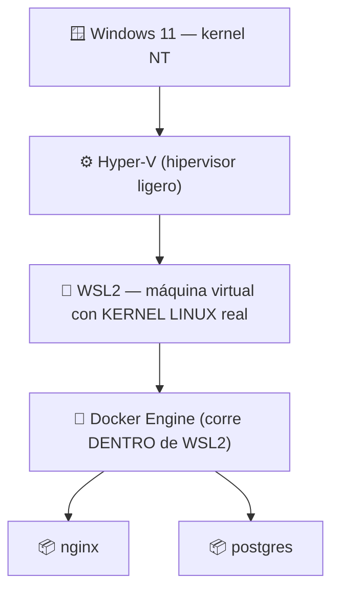

## B6.5.1 — Docker Desktop sobre Windows con WSL2

> [!abstract] Ficha de la práctica
> ### 📌 `B6.5.1` — Docker Desktop sobre Windows con WSL2
> - **Bloque 6** (Aislamiento de servicios) · **Fase B6.5** (Integración libre ↔ propietario) · **Nivel 2** (Intermedio) · **RA.06** · **CE.06.a · CE.06.b**
> - **🎬 Playlist:** `B6_Contenedores`
> - **📹 Nombre del vídeo:** `B6.5.1 · Docker Desktop sobre Windows con WSL2`
> - **Requisito previo:** Fase B6.4 completa. Cliente **Windows 11** del dominio operativo.

> [!info] Caso real (contexto profesional)
> En la empresa los servidores son Linux pero los puestos de trabajo son Windows. Los técnicos necesitan probar en su propio equipo los mismos contenedores que luego irán al servidor, sin montarse una máquina virtual para cada prueba. **Es el escenario heterogéneo típico** y el que evalúa el RA.06.

- **🎯 Objetivo real:** ejecutar contenedores **Linux sobre Windows 11** y entender qué mecanismo lo hace posible.
- **🧩 Problema que resuelve:** en B6.0.1 quedó dicho que un contenedor Linux necesita un kernel Linux. Hoy se ve **de dónde sale ese kernel** en una máquina Windows.

---

## 📚 Fundamento

> [!important] Recupera la frase de B6.0.1
> *"Cuando ejecutes contenedores Linux sobre Windows, lo que ocurre por debajo es que Windows arranca un Linux de verdad y discreto (**WSL2**) para prestarle su kernel."*
>
> Hoy lo compruebas. **No hay magia y no hay excepción a la regla:** un contenedor Linux necesita un kernel Linux, siempre. Si el sistema no lo tiene, **hay que ponerlo**.



> [!info] La conclusión incómoda y honesta
> **Docker Desktop en Windows es, por debajo, una máquina virtual Linux.**
>
> No es un fallo ni una trampa: es la única forma posible. Y encaja perfectamente con lo que viste en B6.0.2: *en el mundo real los contenedores se ejecutan dentro de máquinas virtuales*. Tu portátil Windows es exactamente ese caso.

> [!warning] El fallo nº1: no habilitar la virtualización en la BIOS
> WSL2 necesita **Hyper-V**, y Hyper-V necesita la virtualización por hardware activada en la BIOS/UEFI (**Intel VT-x** o **AMD-V**).
>
> Si está desactivada, la instalación falla con mensajes confusos sobre WSL que no mencionan la BIOS para nada. Compruébalo **antes** en el Administrador de tareas → Rendimiento → CPU → *"Virtualización: Habilitada"*.
>
> ⚠️ **Aviso para quien trabaje en una VM:** si tu Windows 11 es una máquina virtual (Hyper-V o VirtualBox), necesitas **virtualización anidada** habilitada, y en VirtualBox el soporte es limitado. Si no puedes, hazlo en un equipo físico del aula y dilo en el vídeo.

> [!example] Vocabulario de esta práctica
> - **WSL2:** *Windows Subsystem for Linux 2*. Una máquina virtual ligera con **kernel Linux real**.
> - **Docker Desktop:** la aplicación de escritorio que gestiona Docker en Windows y macOS.
> - **Distribución WSL:** cada "Linux" instalado. Docker Desktop crea las suyas: `docker-desktop`.
> - **Virtualización anidada:** virtualizar dentro de una máquina que ya es virtual.
> - **Backend WSL2:** el modo en que Docker Desktop se apoya en WSL2. Es el recomendado.

---

## 📹 Grabación de esta práctica

> [!important] Obligaciones de grabación (LÉEME — es igual en TODAS las prácticas del bloque)
> 1. **Paso 0:** léete el ejercicio y ten a mano OBS y tu identificación. **Crea la entrada de apuntes de esta práctica** en Obsidian: fichero `b6-5-1-docker-desktop-sobre-windows-con-wsl2.md` dentro de `00_Apuntes/Trimestre_N/B6_Contenedores/`, con la estructura de la Fase 0.1 y **vacía**. Rellenarla es cosa tuya, después.
> 2. **Arranca OBS y PRESÉNTATE** mostrando tu identidad (Teams o correo `@alu.edu.gva.es`).
> 3. **Timestamps SIEMPRE:** `00:00 Presentación` y uno por paso.
> 4. **Al terminar:** nombra el vídeo **`B6.5.1 · Docker Desktop sobre Windows con WSL2`** y súbelo a **`B6_Contenedores`** (No listado). Y **pega su enlace dentro de tu entrada de apuntes**, en el apartado `Enlace al vídeo explicativo`.
> 5. **Se graba una sola vez** (no se duplica casa/centro). **La entrega va por la TAREA de Teams:** abriré una tarea que cubrirá **esta práctica y otras**; te llegará notificación con fecha límite. Ahí pegarás el enlace de tu **repositorio de apuntes** — los vídeos ya están dentro de tus entradas.

---

## 🛠️ Procedimiento

> [!example] Paso 0 — Prepárate y empieza a grabar
> Arranca OBS en el **cliente Windows 11** y preséntate. Comprueba la virtualización:
> - `Ctrl+Shift+Esc` → **Rendimiento** → **CPU** → busca *"Virtualización: Habilitada"*.
>
> Enséñalo en pantalla. Si dice *Deshabilitada*, hay que activarla en la BIOS antes de seguir.

> [!example] Paso 1 — Instala WSL2
> En **PowerShell como administrador**:
> ```powershell
> wsl --install
> wsl --status
> ```
> Reinicia si te lo pide. Después:
> ```powershell
> wsl --version
> wsl --list --verbose
> ```
> Fíjate en la línea **`Versión del kernel`**: es un **kernel Linux** corriendo en tu Windows. Enséñalo y coméntalo.

> [!example] Paso 2 — Instala Docker Desktop
> Descarga desde `https://www.docker.com/products/docker-desktop/` e instala **marcando la opción "Use WSL 2 instead of Hyper-V"**.
>
> Al terminar, arranca Docker Desktop y espera a que el icono de la ballena deje de moverse.
>
> > ℹ️ **Licencia:** Docker Desktop es gratuito para uso personal, educativo y en empresas pequeñas. En empresas grandes requiere suscripción. Menciónalo en el vídeo: es información profesional relevante.

> [!example] Paso 3 — Comprueba qué ha aparecido en WSL
> ```powershell
> wsl --list --verbose
> ```
> Ahora hay una distribución nueva: **`docker-desktop`**. **Esa es la máquina virtual Linux donde vive el motor.**
>
> Es la prueba visual de la práctica: Docker no se ha instalado "en Windows", se ha instalado **en un Linux que Windows arranca por ti**.

> [!example] Paso 4 — Tu primer contenedor en Windows
> ```powershell
> docker --version
> docker run hello-world
> docker run -d --name webwin -p 8080:80 nginx
> ```
> Abre el navegador en `http://localhost:8080`. **La página de Nginx, en tu Windows.**
>
> Es exactamente el mismo comando que en Ubuntu Server. **Esa portabilidad es la idea del bloque.**

> [!example] Paso 5 — Demuestra que dentro es Linux
> ```powershell
> docker exec webwin uname -a
> docker exec webwin cat /etc/os-release
> ```
> **`Linux`** y una distribución Debian, en un contenedor lanzado desde una consola de Windows.
>
> Y ahora la comprobación que lo cierra:
> ```powershell
> docker run --rm mcr.microsoft.com/windows/nanoserver:ltsc2022 cmd /c echo hola
> ```
> **Falla.** El motor está en modo Linux y no puede ejecutar imágenes Windows. **La regla del kernel de B6.0.1 se sigue cumpliendo.**

> [!example] Paso 6 — Mira el consumo de recursos
> ```powershell
> wsl --list --verbose
> ```
> En el Administrador de tareas busca el proceso **`Vmmem`** o **`Vmmem WSL`**: es la memoria que consume la máquina virtual de WSL2. Anótala.
>
> Compárala mentalmente con lo que ocuparía una VM Ubuntu completa. Lo mediremos con números en **B6.6.3**.

> [!example] Paso 7 — Los dos motores, uno al lado del otro
> Rellena esta tabla en el vídeo:
>
> | | Ubuntu Server (B6.1.1) | Windows 11 + Docker Desktop |
> |---|---|---|
> | ¿Dónde está el kernel Linux? | Es el del propio SO | En **WSL2** |
> | ¿Hay una VM por debajo? | No | **Sí** |
> | Comando para lanzar Nginx | idéntico | idéntico |
> | ¿Contenedores Windows? | No | No (en modo Linux) |

> [!example] Paso 8 — Limpia y cierra
> ```powershell
> docker rm -f webwin
> docker ps -a
> ```
> **No desinstales Docker Desktop:** lo necesitas en B6.5.2.
>
> Detén OBS, nombra el vídeo **`B6.5.1 · Docker Desktop sobre Windows con WSL2`**, súbelo a **`B6_Contenedores`** y añade timestamps.

---

## 🚩 Errores y verificación

> [!warning] Errores típicos (evítalos)
> | Error | Qué pasa | Cómo evitarlo |
> | :--- | :--- | :--- |
> | Virtualización desactivada en BIOS | WSL2 falla con errores confusos | Compruébalo **antes**, en el Administrador de tareas. |
> | Instalar Docker Desktop sin WSL2 | Modo Hyper-V, más lento y limitado | Marca *"Use WSL 2"*. |
> | Windows 11 dentro de VirtualBox | Virtualización anidada limitada | Usa equipo físico o Hyper-V. |
> | Creer que Docker corre "nativo" en Windows | No se entiende el RA.06 | Por debajo **hay una VM Linux**. |
> | Intentar imágenes Windows en modo Linux | Error de plataforma | Un motor, un tipo de kernel. |
> | No reiniciar tras `wsl --install` | Instalación a medias | Reinicia cuando lo pida. |

> [!success] ✅ Verificación: ¿está bien hecho?
> - `wsl --list --verbose` muestra la distribución **`docker-desktop`**.
> - `docker run hello-world` funciona desde PowerShell.
> - Nginx se ve en `http://localhost:8080` del navegador de Windows.
> - `docker exec ... uname -a` responde **`Linux`**.
> - La imagen de Windows **falla**, y sabes explicar por qué.

> [!question] Comprueba que lo has entendido
> 1. ¿De dónde sale el kernel Linux cuando ejecutas un contenedor Linux en Windows?
> 2. ¿Es cierto que Docker Desktop ejecuta contenedores "nativamente" en Windows? Razónalo.
> 3. ¿Por qué falla la imagen de Windows Server Core estando en Windows?
> 4. Relaciona esta práctica con lo que decidiste en el **eje 1** de [[B6_0.2_Contenedor_vs_Maquina_Virtual|B6.0.2]].
> 5. ¿Por qué esta práctica evalúa el RA.06 (integración de sistemas libres y propietarios)?
> 6. Compara el consumo de `Vmmem` con el de tu VM Ubuntu de Boochan. ¿Qué esperas encontrar?

---

## ✅ Entregables y cierre

- **Entregable:** en el vídeo, `wsl --list --verbose` con `docker-desktop`, Nginx en el navegador de Windows, `uname -a` diciendo Linux, y el fallo de la imagen Windows.
- **Entregable vídeo:** `B6.5.1 · Docker Desktop sobre Windows con WSL2` en `B6_Contenedores`. **Se graba una sola vez** (no se duplica casa/centro). **La entrega va por la TAREA de Teams:** abriré una tarea que cubrirá **esta práctica y otras**; te llegará notificación con fecha límite. Ahí pegarás el enlace de tu **repositorio de apuntes** — los vídeos ya están dentro de tus entradas.
- **Criterio de éxito:** contenedores Linux funcionando en Windows + **saber explicar de dónde sale el kernel**.
- **Entregable apuntes:** `b6-5-1-docker-desktop-sobre-windows-con-wsl2.md` en `B6_Contenedores/`, con la estructura completa, las **respuestas a las preguntas de «Comprueba que lo has entendido»** y el **enlace del vídeo** dentro. Subida al repo con `git add` → `commit` → `push`.

> [!danger] ⚠️ Las respuestas van en la ENTRADA, no sueltas
> Las preguntas de esta práctica no son decorativas: son lo que demuestra que has entendido lo que hiciste, y no solo que supiste seguir los pasos. Se contestan **con tus palabras** en el apartado `Respuesta a las preguntas` de tu entrada.
> Una práctica con el vídeo perfecto y las preguntas en blanco está **incompleta**.

> [!summary] 🎓 Qué has aprendido en este ejercicio
> - Que Windows ejecuta contenedores Linux **arrancando un Linux real (WSL2)** que presta su kernel.
> - Que Docker Desktop es, por debajo, **una máquina virtual**: contenedores dentro de VM, como en B6.0.2.
> - Que **los comandos son idénticos** en Ubuntu Server y en Windows: esa es la portabilidad.
> - Que la regla del kernel **no tiene excepciones**: las imágenes Windows siguen sin funcionar.
>
> **Siguiente:** [[B6_5.2_Compartir_Carpeta_Windows|B6.5.2 — Compartir una carpeta entre Windows y el contenedor Linux]].
