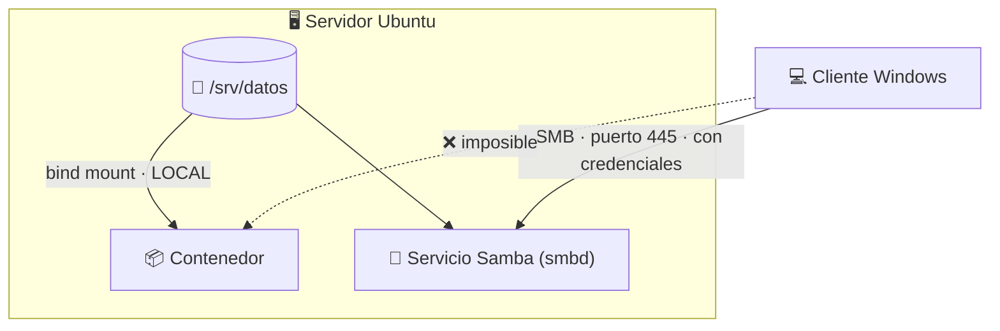

## B6.5.3 — Comparativa con Samba y NFS de UD07

> [!abstract] Ficha de la práctica
> ### 📌 `B6.5.3` — Comparativa con Samba y NFS de UD07
> - **Bloque 6** (Aislamiento de servicios) · **Fase B6.5** (Integración libre ↔ propietario) · **Nivel 2** (Intermedio) · **RA.06** · **CE.06.a · CE.06.c**
> - **🎬 Playlist:** `B6_Contenedores`
> - **📹 Nombre del vídeo:** `B6.5.3 · Comparativa con Samba y NFS`
> - **Requisito previo:** [[B6_5.2_Compartir_Carpeta_Windows|B6.5.2]] y **UD07** (Samba/NFS).

> [!info] Caso real (contexto profesional)
> Te piden que los ficheros de un servicio sean accesibles para varios equipos del aula. Tienes tres mecanismos sobre la mesa: un **volumen**, un ***bind mount*** y una **compartición de red (Samba/NFS)**. Elegir mal significa o bien datos inaccesibles, o bien un servicio de red innecesario y expuesto. **Describir la funcionalidad de los servicios que permiten compartir recursos en red es el CE.06.c.**

- **🎯 Objetivo real:** situar los tres mecanismos, comprobar experimentalmente qué puede hacer cada uno y construir un criterio de elección.
- **🧩 Problema que resuelve:** los alumnos salen del bloque creyendo que un *bind mount* "es como una carpeta compartida". **No lo es**, y confundirlos genera diseños imposibles.

---

## 📚 Fundamento

> [!important] La diferencia que lo ordena todo: ¿hay red o no?
> - **Volumen y *bind mount*** son mecanismos **locales**: el contenedor y el disco están **en la misma máquina**. No hay red, ni servicio, ni autenticación.
> - **Samba y NFS** son **servicios de red**: existe un servidor, un cliente, un protocolo, credenciales y un puerto.
>
> Todo lo demás sale de ahí. **Un *bind mount* no puede compartir nada con otro equipo, por definición.**



> [!warning] El fallo nº1: querer que un *bind mount* sirva a varios equipos
> *"Monto la carpeta en el contenedor y así todos los del aula la ven."* **No.** El montaje solo existe dentro del servidor.
>
> Para que la vean otros equipos hace falta **un servicio de red por encima**: Samba o NFS. Son cosas complementarias, no alternativas — y de hecho se combinan.

> [!example] Vocabulario de esta práctica
> - **SMB/CIFS:** protocolo de compartición de Windows. Puerto **445**. Lo implementa **Samba** en Linux.
> - **NFS:** protocolo de compartición de Unix. Puerto **2049**. Más rápido, autenticación más débil.
> - **Montaje local:** volumen o *bind mount*. Sin red.
> - **Cliente/servidor:** en Samba hay dos partes. En un *bind mount* no hay ninguna.
> - **Mapeo de identidades:** cómo cada protocolo traduce usuarios entre sistemas. Es lo que más los diferencia.

---

## 📹 Grabación de esta práctica

> [!important] Obligaciones de grabación (LÉEME — es igual en TODAS las prácticas del bloque)
> 1. **Paso 0:** léete el ejercicio y ten a mano OBS y tu identificación. **Crea la entrada de apuntes de esta práctica** en Obsidian: fichero `b6-5.3-comparativa-con-samba-y-nfs.md` dentro de `00_Apuntes/Trimestre_N/B6_Contenedores/`, con la estructura de la Fase 0.1 y **vacía**. Rellenarla es cosa tuya, después.
> 2. **Arranca OBS y PRESÉNTATE** mostrando tu identidad (Teams o correo `@alu.edu.gva.es`).
> 3. **Timestamps SIEMPRE:** `00:00 Presentación` y uno por paso.
> 4. **Al terminar:** nombra el vídeo **`B6.5.3 · Comparativa con Samba y NFS`** y súbelo a **`B6_Contenedores`** (No listado). Y **pega su enlace dentro de tu entrada de apuntes**, en el apartado `Enlace al vídeo explicativo`.
> 5. **Se graba una sola vez** (no se duplica casa/centro). **La entrega va por la TAREA de Teams:** abriré una tarea que cubrirá **esta práctica y otras**; te llegará notificación con fecha límite. Ahí pegarás el enlace de tu **repositorio de apuntes** — los vídeos ya están dentro de tus entradas.

---

## 🛠️ Procedimiento

> [!example] Paso 0 — Prepárate y empieza a grabar
> Arranca OBS en el **servidor Ubuntu** y preséntate. Comprueba que tu Samba de Boochan sigue vivo:
> ```bash
> systemctl status smbd --no-pager | head -5
> ```

> [!example] Paso 1 — Prepara la carpeta común
> ```bash
> sudo mkdir -p /srv/comun
> echo "fichero comun" | sudo tee /srv/comun/comun.txt
> sudo chmod 775 /srv/comun
> ls -ln /srv/comun
> ```

> [!example] Paso 2 — Accede con *bind mount* (local)
> ```bash
> docker run --rm -v /srv/comun:/datos alpine cat /datos/comun.txt
> ```
> **Funciona, y no ha hecho falta ningún servicio.** Ni Samba, ni puertos, ni credenciales.

> [!example] Paso 3 — Comprueba lo que NO puede hacer
> Desde el **cliente Windows**, intenta acceder a esa carpeta sin Samba:
> ```powershell
> \\IP_DEL_SERVIDOR\comun
> ```
> **No existe.** Es la demostración de que un *bind mount* **no comparte nada por red**.

> [!example] Paso 4 — Añade el servicio de red por encima
> ```bash
> sudo tee -a /etc/samba/smb.conf > /dev/null <<'EOF'
>
> [comun]
>    path = /srv/comun
>    browseable = yes
>    read only = no
>    valid users = @"BOOCHAN\Domain Users"
> EOF
> sudo systemctl restart smbd
> sudo smbclient -L localhost -N | head -20
> ```
> Ajusta `valid users` a tu dominio real. Ahora **sí**, desde Windows:
> ```powershell
> \\IP_DEL_SERVIDOR\comun
> ```
> **La misma carpeta, ahora accesible desde otro equipo.** Con autenticación de dominio.

> [!example] Paso 5 — Los dos a la vez sobre la misma carpeta
> ```bash
> docker run -d --name webcomun -p 8080:80 -v /srv/comun:/usr/share/nginx/html:ro nginx
> echo "<h1>Editado desde Windows por Samba</h1>" | sudo tee /srv/comun/index.html
> curl http://localhost:8080
> ```
> Edita `index.html` **desde el cliente Windows** por la unidad de red y recarga `http://IP:8080`.
>
> **Una persona edita por Samba desde Windows; un contenedor Linux lo publica.** Esta es la arquitectura real de muchas empresas y el mejor resumen del RA.06. **Grábalo.**

> [!example] Paso 6 — Comprueba los puertos y los servicios
> ```bash
> sudo ss -tlnp | grep -E ':445|:2049|:8080'
> ps aux | grep -c smbd
> ```
> Samba tiene **procesos y puertos**. El *bind mount* **no tiene nada**: no es un servicio, es una operación del kernel.

> [!example] Paso 7 — La tabla comparativa (entregable escrito)
> Complétala tú y entrégala:
>
> | Criterio | 💾 Volumen | 📁 *Bind mount* | 🔗 Samba | 🔗 NFS |
> |---|---|---|---|---|
> | ¿Hay red? | | | | |
> | ¿Servicio corriendo? | | | | |
> | Puerto | | | | |
> | ¿Autenticación? | | | | |
> | ¿Otros equipos? | | | | |
> | Identidades | | | | |
> | Rendimiento | | | | |
> | Caso de uso típico | | | | |

> [!example] Paso 8 — El criterio de decisión
> Escribe en el vídeo tu regla en tres líneas. Una posible:
> > *Si el dato lo consume solo un contenedor del mismo servidor → **volumen**. Si además lo edito yo en el servidor → ***bind mount***. Si lo tienen que ver otros equipos → **Samba** (con Windows) o **NFS** (solo Linux), montado sobre la misma carpeta.*

> [!example] Paso 9 — Limpia y cierra
> ```bash
> docker rm -f webcomun
> ```
> Deja el recurso Samba montado si te sirve para Boochan; si no, quita la sección de `smb.conf` y reinicia `smbd`.
>
> Detén OBS, nombra el vídeo **`B6.5.3 · Comparativa con Samba y NFS`**, súbelo a **`B6_Contenedores`** y añade timestamps.

---

## 🚩 Errores y verificación

> [!warning] Errores típicos (evítalos)
> | Error | Qué pasa | Cómo evitarlo |
> | :--- | :--- | :--- |
> | Creer que un *bind mount* comparte por red | Diseño imposible | Local ≠ red. Compruébalo desde Windows. |
> | Montar una unidad de red como *bind mount* | Bloqueos y rendimiento pésimo | Monta rutas de **disco local**. |
> | Usar NFS para clientes Windows | Soporte pobre y permisos raros | Windows → **Samba**. |
> | Editar `smb.conf` sin `testparm` | Samba no arranca | `sudo testparm` antes de reiniciar. |
> | Olvidar `:ro` en el contenido web | El servicio puede alterar los ficheros comunes | `:ro` cuando solo hay que leer. |
> | Exponer 445 fuera de la red interna | Riesgo de seguridad serio | Firewall y red interna. |

> [!success] ✅ Verificación: … ¿está bien hecho?
> - El *bind mount* funciona **sin ningún servicio**.
> - Has comprobado que **no** es accesible desde Windows sin Samba.
> - Tras configurar Samba, **la misma carpeta** sí se ve desde Windows.
> - Editas desde Windows por Samba y **el contenedor lo publica**.
> - Tabla comparativa completa y criterio de decisión escrito.

> [!question] Comprueba que lo has entendido
> 1. Diferencia esencial entre un montaje local y una compartición de red.
> 2. ¿Por qué un *bind mount* no necesita autenticación y Samba sí?
> 3. ¿Cuándo elegirías NFS en vez de Samba? ¿Y al revés?
> 4. Explica el escenario del Paso 5 como si se lo contaras al jefe: quién edita, quién publica, qué mecanismo usa cada uno.
> 5. ¿Por qué no se debe montar una unidad de red como *bind mount* de un contenedor?
> 6. ¿Qué aporta este montaje mixto frente a que el diseñador editara directamente en el servidor por SSH?

---

## ✅ Entregables y cierre

- **Entregable:** en el vídeo, el *bind mount* funcionando sin servicio, su inaccesibilidad desde Windows, y **la edición por Samba publicada por el contenedor**.
- **Entregable escrito:** la tabla comparativa completa + tu criterio de decisión en tres líneas.
- **Entregable vídeo:** `B6.5.3 · Comparativa con Samba y NFS` en `B6_Contenedores`. **Se graba una sola vez** (no se duplica casa/centro). **La entrega va por la TAREA de Teams:** abriré una tarea que cubrirá **esta práctica y otras**; te llegará notificación con fecha límite. Ahí pegarás el enlace de tu **repositorio de apuntes** — los vídeos ya están dentro de tus entradas.
- **Criterio de éxito:** distinguir los cuatro mecanismos y **saber elegir** con argumentos.
- **Entregable apuntes:** `b6-5.3-comparativa-con-samba-y-nfs.md` en `B6_Contenedores/`, con la estructura completa, las **respuestas a las preguntas de «Comprueba que lo has entendido»** y el **enlace del vídeo** dentro. Subida al repo con `git add` → `commit` → `push`.

> [!danger] ⚠️ Las respuestas van en la ENTRADA, no sueltas
> Las preguntas de esta práctica no son decorativas: son lo que demuestra que has entendido lo que hiciste, y no solo que supiste seguir los pasos. Se contestan **con tus palabras** en el apartado `Respuesta a las preguntas` de tu entrada.
> Una práctica con el vídeo perfecto y las preguntas en blanco está **incompleta**.

> [!summary] 🎓 Qué has aprendido en este ejercicio
> - Que volumen y *bind mount* son **locales**; Samba y NFS son **servicios de red**. No compiten: se apilan.
> - Que un *bind mount* **no puede** servir a otro equipo, por definición.
> - Que la combinación **Samba + contenedor sobre la misma carpeta** es una arquitectura real y muy potente.
> - Que Windows pide Samba y Linux puro admite NFS.
>
> ---
>
> **Con esto se cierra la Fase B6.5.** Has integrado el mundo libre y el propietario en las dos direcciones.
>
> **Siguiente:** [[B6_6.1_Docker_Stats_vs_Htop|B6.6.1 — `docker stats` frente a `htop`]] · **RA.05**.
