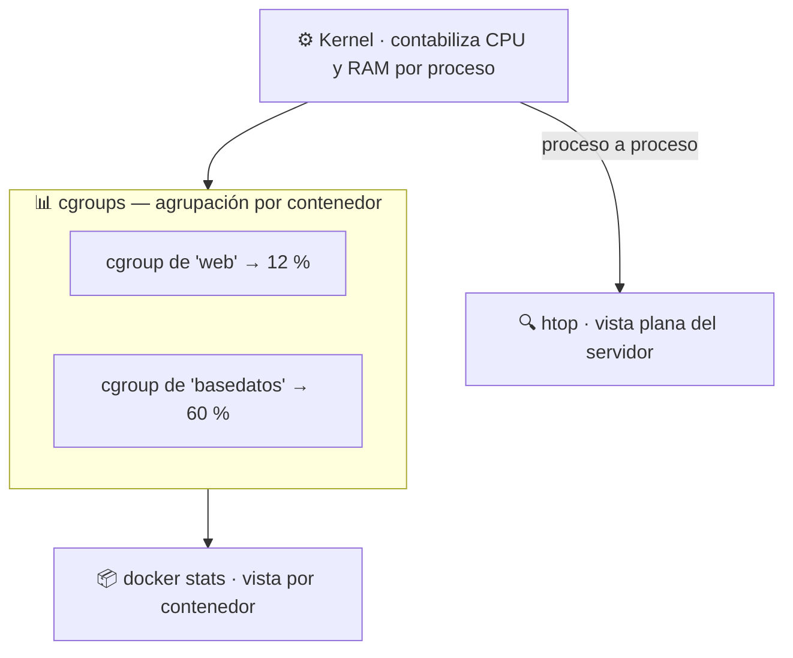

## B6.6.1 — `docker stats` frente a `htop`

> [!abstract] Ficha de la práctica
> ### 📌 `B6.6.1` — `docker stats` frente a `htop`
> - **Bloque 6** (Aislamiento de servicios) · **Fase B6.6** (Monitorización) · **Nivel 1** (Básico) · **RA5** · **CE 5.a, 5.f**
> - **🎬 Playlist:** `B6_Contenedores`
> - **📹 Nombre del vídeo:** `B6.6.1 · docker stats frente a htop`
> - **Requisito previo:** [[B6_2.2_Procesos_Dentro_y_Fuera|B6.2.2]] (la demostración de los procesos).

> [!info] Caso real (contexto profesional)
> Son las nueve de la mañana y el servidor del aula va a rastras. Tienes cinco contenedores corriendo. La pregunta del jefe es siempre la misma: **"¿quién se lo está comiendo?"**. En una máquina virtual tendrías que entrar dentro para averiguarlo. Aquí no: se ve desde fuera, en una tabla, en cinco segundos.

- **🎯 Objetivo real:** monitorizar el consumo de CPU y memoria de los contenedores desde el anfitrión y **saber leer** lo que dicen las dos herramientas.
- **🧩 Problema que resuelve:** diagnosticar un servidor cargado sin adivinar. **Utilizar herramientas de monitorización del sistema es el CE 5.a.**

---

## 📚 Fundamento

> [!info] La otra mitad del aislamiento: los *cgroups*
> En B6.2.2 viste los **espacios de nombres**: deciden **qué ve** un proceso.
>
> Falta la otra mitad. Los ***control groups*** (grupos de control, o *cgroups*) deciden **cuánto consume**: cuánta CPU, cuánta RAM, cuánta escritura a disco.
>
> **Dos mecanismos, dos preguntas:**
>
> | Mecanismo | Pregunta que responde | Lo viste en |
> |---|---|---|
> | Espacios de nombres | ¿Qué **ve** el proceso? | B6.2.2 |
> | *Cgroups* | ¿Cuánto **gasta** el proceso? | **hoy** |
>
> Juntos son el aislamiento entero. No hay más magia: es el kernel de tu Ubuntu contabilizando y limitando.

> [!info] Por qué existen dos herramientas y no una
> `htop` es la herramienta de siempre de Linux: te enseña **todos los procesos** del servidor, uno por uno, sin saber nada de contenedores.
>
> `docker stats` no te enseña procesos: te enseña **cgroups**, es decir, el consumo **agrupado por contenedor**. Es el mismo dato, sumado y con nombre.
>
> **Ninguna sustituye a la otra.** `docker stats` te dice *qué contenedor*; `htop` te dice *qué proceso concreto* dentro de él.



> [!warning] El fallo nº1: leer mal la columna `MEM USAGE / LIMIT`
> Arrancas un contenedor, ejecutas `docker stats` y ves algo así:
>
> ```
> MEM USAGE / LIMIT     MEM %
> 3.5MiB / 3.8GiB       0.09%
> ```
>
> Y piensas: *"el contenedor tiene 3,8 GB de RAM asignados"*. **No.** Ese `LIMIT` es **la RAM de tu servidor entero**, porque el contenedor **no tiene ningún límite puesto**. Puede comerse toda la máquina si le da por ahí.
>
> Un contenedor sin `--memory` no está limitado. Está *contabilizado*, que es distinto. Hoy vas a ponerle el límite y ver cómo cambia ese número.

> [!example] Vocabulario de esta práctica
> - ***Cgroup* (grupo de control):** mecanismo del kernel que contabiliza y limita los recursos de un grupo de procesos.
> - **`docker stats`:** consumo en vivo **agrupado por contenedor**.
> - **`htop`:** monitor de procesos clásico de Linux. No sabe qué es un contenedor.
> - **`--memory` / `--cpus`:** opciones de `docker run` que ponen el techo de RAM y CPU.
> - **OOM (*Out Of Memory*):** cuando un proceso pide más memoria de la permitida, el kernel lo mata. En `docker ps -a` aparece como salida `137`.

---

## 📹 Grabación de esta práctica

> [!important] Obligaciones de grabación (LÉEME — es igual en TODAS las prácticas del bloque)
> 1. **Paso 0:** léete el ejercicio y ten a mano OBS y tu identificación. **Crea la entrada de apuntes de esta práctica** en Obsidian: fichero `b6-6-1-docker-stats-frente-a-htop.md` dentro de `00_Apuntes/Trimestre_N/B6_Contenedores/`, con la estructura de la Fase 0.1 y **vacía**. Rellenarla es cosa tuya, después.
> 2. **Arranca OBS y PRESÉNTATE** mostrando tu identidad (Teams o correo `@alu.edu.gva.es`).
> 3. **Timestamps SIEMPRE:** `00:00 Presentación` y uno por paso.
> 4. **Al terminar:** nombra el vídeo **`B6.6.1 · docker stats frente a htop`** y súbelo a **`B6_Contenedores`** (No listado). Y **pega su enlace dentro de tu entrada de apuntes**, en el apartado `Enlace al vídeo explicativo`.
> 5. **Una sola entrega.**

---

## 🛠️ Procedimiento

> [!example] Paso 0 — Prepárate y empieza a grabar
> Arranca OBS en tu **servidor Ubuntu** y preséntate. Comprueba que tienes `htop`:
> ```bash
> htop --version || sudo apt install -y htop
> docker ps -a
> ```

> [!example] Paso 1 — Levanta algo que se pueda medir
> ```bash
> docker run -d --name web -p 8080:80 nginx
> docker run -d --name ocupado alpine sh -c "while true; do :; done"
> docker ps
> ```
> El segundo contenedor ejecuta un bucle infinito **a propósito**: es tu "servicio que se ha vuelto loco". Sin un culpable no hay diagnóstico que practicar.

> [!example] Paso 2 — La foto por contenedor
> ```bash
> docker stats
> ```
> Se actualiza solo. Míralo unos segundos y **lee la tabla en voz alta**: qué contenedor, cuánta CPU, cuánta memoria.
>
> **`ocupado` está cerca del 100 % de una CPU.** Ahí está tu culpable, con nombre y apellidos.
>
> Sal con `Ctrl+C`. Si lo quieres para un script, en una sola pasada:
> ```bash
> docker stats --no-stream
> ```

> [!example] Paso 3 — La misma verdad, vista con `htop`
> ```bash
> htop
> ```
> Ordena por CPU (tecla `F6`, eliges `PERCENT_CPU`) y busca arriba el proceso `sh` que está al 100 %.
>
> **Está ahí, entre los procesos de tu servidor**, exactamente como en B6.2.2. Pero fíjate en lo que `htop` **no** te dice: no te dice de qué contenedor es. Ves el síntoma, no el responsable.
>
> Sal con `q` y ata los dos cabos:
> ```bash
> docker top ocupado
> ```
> Ese PID es el que estabas mirando en `htop`. **Misma información, dos niveles de lectura.**

> [!example] Paso 4 — Ponle un techo a la CPU
> ```bash
> docker rm -f ocupado
> docker run -d --name ocupado --cpus="0.5" alpine sh -c "while true; do :; done"
> docker stats --no-stream ocupado
> ```
> Ahora se queda en torno al **50 %**. El bucle sigue siendo infinito —el programa no ha cambiado nada— pero **el kernel no le deja pasar de ahí**.
>
> Dilo en el vídeo: *"no he tocado el programa, he tocado el cgroup"*.

> [!example] Paso 5 — Ponle un techo a la memoria y mira qué pasa cuando lo rompe
> ```bash
> docker run -d --name tragon --memory="64m" alpine sh -c "sleep 3600"
> docker stats --no-stream tragon
> ```
> Ahora el `LIMIT` sí es **64 MiB**, no la RAM de tu servidor. Compáralo con lo que veías en el Paso 2.
>
> Fuérzalo a saltárselo:
> ```bash
> docker run --name suicida --memory="32m" alpine sh -c "tail /dev/zero"
> docker ps -a | grep suicida
> ```
> El contenedor **muere**. En la columna `STATUS` verás `Exited (137)`. Ese **137** es la firma del **OOM killer**: el kernel lo ha matado por pasarse de la RAM permitida.
>
> Confírmalo:
> ```bash
> docker inspect suicida --format '{{.State.OOMKilled}}'
> ```
> Debe responder `true`. **Esto es exactamente lo que le pasa en producción a un servicio mal dimensionado.**

> [!example] Paso 6 — Comprueba que el límite es del kernel, no de Docker
> ```bash
> docker exec tragon cat /sys/fs/cgroup/memory.max
> ```
> Devuelve `67108864` — los 64 MiB en bytes. **El límite está escrito en el sistema de ficheros del kernel**, no en un fichero de configuración de Docker. Docker solo se lo pidió.
>
> Si tu Ubuntu es antiguo y usa *cgroups v1*, la ruta es `/sys/fs/cgroup/memory/memory.limit_in_bytes`. Prueba la otra y dilo en el vídeo.

> [!example] Paso 7 — Anota los datos (entregable escrito)
> Rellena esta tabla con **tus** números:
>
> | Contenedor | CPU % | MEM USAGE / LIMIT | ¿Tiene límite? |
> |---|---|---|---|
> | `web` | | | |
> | `ocupado` (sin `--cpus`) | | | |
> | `ocupado` (con `--cpus=0.5`) | | | |
> | `tragon` (`--memory=64m`) | | | |

> [!example] Paso 8 — Limpia y cierra
> ```bash
> docker rm -f web ocupado tragon suicida
> docker ps -a
> ```
> Detén OBS, nombra el vídeo **`B6.6.1 · docker stats frente a htop`**, súbelo a **`B6_Contenedores`** y añade timestamps.

---

## 🚩 Errores y verificación

> [!warning] Errores típicos (evítalos)
> | Error | Qué pasa | Cómo evitarlo |
> | :--- | :--- | :--- |
> | Leer el `LIMIT` como RAM asignada | Crees que está limitado y no lo está | Sin `--memory`, el `LIMIT` es la RAM del servidor. |
> | Dejar el bucle infinito corriendo | Calientas el servidor toda la clase | `docker rm -f ocupado` al terminar. Compruébalo. |
> | Buscar el contenedor culpable en `htop` | `htop` no sabe de contenedores | `docker stats` primero, `htop` después. |
> | Poner `--cpus="2"` en una VM de 1 vCPU | El límite no hace nada | Mira `nproc` antes de decidir el techo. |
> | Confundir `Exited (137)` con un fallo de la aplicación | Buscas el error donde no está | `137` con `OOMKilled: true` es falta de RAM. |
> | Usar `docker stats` en un script sin `--no-stream` | El script se queda colgado para siempre | `--no-stream` cuando no hay persona mirando. |

> [!success] ✅ Verificación: ¿está bien hecho?
> - Has identificado el contenedor que consume CPU **por su nombre**, con `docker stats`.
> - Has localizado **el mismo proceso** en `htop` y lo has atado a su contenedor con `docker top`.
> - Con `--cpus="0.5"` el consumo baja a la mitad **sin tocar el programa**.
> - Con `--memory` el `LIMIT` cambia, y al superarlo el contenedor muere con **137**.
> - Has leído el límite en `/sys/fs/cgroup/`.

> [!question] Comprueba que lo has entendido
> 1. Con tus palabras: ¿qué hace un espacio de nombres y qué hace un *cgroup*? Pon un ejemplo tuyo de cada uno.
> 2. Un contenedor sin `--memory` aparece con `LIMIT 3.8GiB`. ¿Está limitado a 3,8 GB? Explica la respuesta.
> 3. ¿Por qué `htop` ve el proceso del contenedor pero no sabe a qué contenedor pertenece?
> 4. Un compañero dice que `docker stats` sustituye a `htop`. Dale un caso concreto en el que necesites `htop` de todas formas.
> 5. Un contenedor sale con código `137` cada dos horas. ¿Qué sospechas y con qué comando lo confirmas?
> 6. ¿Por qué el límite de memoria acaba escrito en `/sys/fs/cgroup/` y no en un fichero de Docker? ¿Quién manda aquí de verdad?

---

## ✅ Entregables y cierre

- **Entregable:** en el vídeo, el contenedor culpable identificado con `docker stats`, el mismo proceso localizado en `htop`, el efecto de `--cpus` y **la muerte por OOM con código 137**.
- **Entregable escrito:** la tabla de los cuatro contenedores con tus números.
- **Entregable vídeo:** `B6.6.1 · docker stats frente a htop` en `B6_Contenedores`. **Una sola entrega.**
- **Criterio de éxito:** diagnosticar qué contenedor consume y **saber ponerle un techo**.
- **Entregable apuntes:** `b6-6-1-docker-stats-frente-a-htop.md` en `B6_Contenedores/`, con la estructura completa, las **respuestas a las preguntas de «Comprueba que lo has entendido»** y el **enlace del vídeo** dentro. Subida al repo con `git add` → `commit` → `push`.

> [!danger] ⚠️ Las respuestas van en la ENTRADA, no sueltas
> Las preguntas de esta práctica no son decorativas: son lo que demuestra que has entendido lo que hiciste, y no solo que supiste seguir los pasos. Se contestan **con tus palabras** en el apartado `Respuesta a las preguntas` de tu entrada.
> Una práctica con el vídeo perfecto y las preguntas en blanco está **incompleta**.

> [!summary] 🎓 Qué has aprendido en este ejercicio
> - Que el aislamiento tiene **dos mitades**: los espacios de nombres (qué ve) y los *cgroups* (cuánto gasta).
> - Que `docker stats` responde *"¿qué contenedor?"* y `htop` responde *"¿qué proceso?"*. Se usan juntas.
> - Que un contenedor **sin límite puede comerse el servidor entero**, y que ponerle techo es una línea.
> - Que el `137` es el kernel matando un proceso por RAM, no un fallo de tu aplicación.
> - Que los límites viven en el kernel, no en Docker.
>
> **Siguiente:** [[B6_6.2_Docker_Logs|B6.6.2 — Registros del servicio con `docker logs`]].
