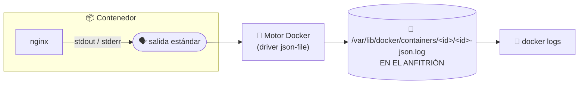

## B6.6.2 — Registros del servicio con `docker logs`

> [!abstract] Ficha de la práctica
> ### 📌 `B6.6.2` — Registros del servicio con `docker logs`
> - **Bloque 6** (Aislamiento de servicios) · **Fase B6.6** (Monitorización) · **Nivel 1** (Básico) · **RA5** · **CE 5.c**
> - **🎬 Playlist:** `B6_Contenedores`
> - **📹 Nombre del vídeo:** `B6.6.2 · Registros del servicio con docker logs`
> - **Requisito previo:** [[B6_6.1_Docker_Stats_vs_Htop|B6.6.1]] y [[B6_2.3_El_Contenedor_es_Efimero|B6.2.3]] (lo efímero).

> [!info] Caso real (contexto profesional)
> Un contenedor se para solo cada madrugada. Cuando llegas por la mañana ya no está corriendo: no puedes entrar a mirar, porque no hay dónde entrar. **La única pista que queda de lo que pasó son sus registros.** Si no sabes leerlos, el problema es invisible y se repetirá mañana.

- **🎯 Objetivo real:** consultar, filtrar y conservar las **trazas que genera el propio sistema** para diagnosticar un servicio en contenedor.
- **🧩 Problema que resuelve:** en B6.2.3 aprendiste que lo que se escribe dentro **desaparece**. Entonces, ¿dónde quedan los registros? Hoy se responde. **Interpretar las trazas generadas por el propio sistema es el CE 5.c.**

---

## 📚 Fundamento

> [!info] La regla que lo cambia todo: un contenedor no escribe logs, los *habla*
> En un servidor de toda la vida, un servicio escribe en `/var/log/algo.log`. Tú vas allí y lo lees. Lo hiciste en Boochan con Samba.
>
> En un contenedor **eso está prohibido por sentido común**: lo que se escriba dentro se borra con el contenedor (B6.2.3), y a nadie le sirve un registro que muere con el problema que documenta.
>
> Por eso la norma de la industria es otra: **el servicio escribe sus mensajes en la salida estándar** (`stdout`) **y los errores en la salida de error** (`stderr`), como quien habla en voz alta. **El motor los recoge y los guarda fuera**, en el anfitrión.
>
> El contenedor no gestiona sus registros. **Los dice y se olvida.**



> [!info] Ancla con lo que ya sabes
> Esto no es un invento de Docker. Es la misma idea que ya usa tu Ubuntu:
>
> | | Servicio de systemd (Boochan) | Servicio en contenedor |
> |---|---|---|
> | El servicio escribe en... | `stdout` o su fichero | **`stdout`** |
> | Quién lo recoge | `journald` | **el motor Docker** |
> | Cómo se consulta | `journalctl -u smbd` | **`docker logs web`** |
> | Seguir en vivo | `journalctl -f` | **`docker logs -f`** |
>
> **Mismo patrón, distinto recolector.** Si entendiste `journalctl`, ya entiendes esto.

> [!warning] El fallo nº1: ir a buscar el log dentro del contenedor
> Entras con `docker exec`, haces `cat /var/log/nginx/access.log` y **está vacío**. Concluyes que el servicio no registra nada. Falso.
>
> Mira el fichero con `ls -l` y lo entenderás: en la imagen oficial de Nginx **ese fichero es un enlace simbólico a `/dev/stdout`**. Los creadores de la imagen lo montaron así a propósito para que el registro salga fuera.
>
> No es un fichero. Es un altavoz.

> [!example] Vocabulario de esta práctica
> - **`stdout` / `stderr`:** salida estándar y salida de error. Los dos canales por los que un programa "habla".
> - ***Driver* de registro:** quién recoge lo que dice el contenedor. El de serie es **`json-file`**.
> - **`docker logs`:** muestra lo recogido. **No lee nada de dentro del contenedor.**
> - **Rotación:** trocear el registro para que no se coma el disco (`max-size`, `max-file`).
> - **`journalctl`:** el equivalente de systemd. Mismo concepto, otro recolector.

---

## 📹 Grabación de esta práctica

> [!important] Obligaciones de grabación (LÉEME — es igual en TODAS las prácticas del bloque)
> 1. **Paso 0:** léete el ejercicio y ten a mano OBS y tu identificación. **Crea la entrada de apuntes de esta práctica** en Obsidian: fichero `b6-6-2-registros-del-servicio-con-docker-logs.md` dentro de `00_Apuntes/Trimestre_N/B6_Contenedores/`, con la estructura de la Fase 0.1 y **vacía**. Rellenarla es cosa tuya, después.
> 2. **Arranca OBS y PRESÉNTATE** mostrando tu identidad (Teams o correo `@alu.edu.gva.es`).
> 3. **Timestamps SIEMPRE:** `00:00 Presentación` y uno por paso.
> 4. **Al terminar:** nombra el vídeo **`B6.6.2 · Registros del servicio con docker logs`** y súbelo a **`B6_Contenedores`** (No listado). Y **pega su enlace dentro de tu entrada de apuntes**, en el apartado `Enlace al vídeo explicativo`.
> 5. **Una sola entrega.**

---

## 🛠️ Procedimiento

> [!example] Paso 0 — Prepárate y empieza a grabar
> Arranca OBS en tu **servidor Ubuntu** y preséntate.
> ```bash
> docker run -d --name web -p 8080:80 nginx
> docker ps
> ```

> [!example] Paso 1 — Genera tráfico y léelo
> ```bash
> curl http://localhost:8080
> curl http://localhost:8080/no-existe
> docker logs web
> ```
> Ahí están las dos peticiones: la buena (**200**) y la que ha fallado (**404**). Léelas en voz alta e identifica en la línea la **hora**, la **IP**, la **petición** y el **código**.

> [!example] Paso 2 — La demostración: el fichero de log es un altavoz
> ```bash
> docker exec web ls -l /var/log/nginx/
> ```
> Fíjate bien en la salida:
> ```
> access.log -> /dev/stdout
> error.log  -> /dev/stderr
> ```
> **No son ficheros: son enlaces a las salidas estándar.** Compruébalo:
> ```bash
> docker exec web cat /var/log/nginx/access.log
> ```
> No sale nada útil. **Y sin embargo `docker logs` sí tiene el registro.** Explica en el vídeo por qué: porque el registro **no vive dentro**, vive en tu servidor.

> [!example] Paso 3 — Filtra como se hace de verdad
> Un registro largo no se lee entero. Se filtra:
> ```bash
> docker logs --tail 5 web
> docker logs --since 10m web
> docker logs --timestamps web | tail -3
> docker logs web 2>/dev/null | grep " 404 "
> ```
> - `--tail` → solo el final. **El comando que más vas a usar.**
> - `--since` → desde hace un rato (o `--since 2026-03-16T08:00:00`).
> - `--timestamps` → añade la marca de tiempo del motor.
> - El `grep` del final: **así se busca un fallo concreto**.

> [!example] Paso 4 — Separa la información del error
> ```bash
> docker logs web 1>/dev/null
> ```
> Lo que veas ahora es **solo `stderr`**: los errores. Y al revés:
> ```bash
> docker logs web 2>/dev/null
> ```
> Ahora solo los accesos normales. **`docker logs` respeta los dos canales**, no los mezcla. Un servicio bien hecho separa lo rutinario de lo grave, y tú puedes quedarte solo con lo grave.

> [!example] Paso 5 — Seguir en vivo (como `journalctl -f`)
> Abre una **segunda sesión SSH** al servidor. En la primera:
> ```bash
> docker logs -f web
> ```
> En la segunda, lanza peticiones:
> ```bash
> curl http://localhost:8080
> curl http://localhost:8080/tampoco-existe
> ```
> Las líneas aparecen **en el momento**. Así se depura un servicio en producción: con el log delante mientras alguien reproduce el fallo. Sal con `Ctrl+C`.

> [!example] Paso 6 — ¿Dónde está el fichero de verdad?
> ```bash
> docker inspect --format '{{.LogPath}}' web
> sudo tail -2 $(docker inspect --format '{{.LogPath}}' web)
> ```
> Es un fichero **JSON**, uno por línea, en `/var/lib/docker/containers/…`, **propiedad de root, en tu servidor**.
>
> Ahí se ve por qué el registro sobrevive: no está en el contenedor. Está en el anfitrión.

> [!example] Paso 7 — La prueba que da sentido a todo: mátalo y lee lo que dejó
> ```bash
> docker stop web
> docker ps
> docker logs web
> ```
> **El contenedor está parado y sus registros siguen ahí.** Este es el caso real del principio: llegas por la mañana, el servicio está caído, y los registros te cuentan qué pasó.
>
> Compáralo con lo que aprendiste en B6.2.3: un fichero escrito **dentro** se habría perdido. El log **no**, porque nunca estuvo dentro.
>
> ```bash
> docker start web
> ```

> [!example] Paso 8 — Que el registro no se coma el disco
> Sin control, un servicio parlanchín llena el disco del servidor. Se le pone límite al crear el contenedor:
> ```bash
> docker run -d --name weblim -p 8081:80 \
>   --log-opt max-size=1m --log-opt max-file=3 nginx
> docker inspect --format '{{.HostConfig.LogConfig}}' weblim
> ```
> Como mucho **3 ficheros de 1 MB**: 3 MB y ni un byte más. Cuando se llena, se descarta lo más viejo.
>
> **Esto no es un adorno.** Un disco lleno de logs tira abajo el servidor entero, y es una de las averías más comunes y más tontas que existen.

> [!example] Paso 9 — Compáralo con tu servidor de Boochan
> ```bash
> journalctl -u ssh --no-pager | tail -5
> ```
> Mismo tipo de información, misma forma de consultarla, **otro recolector**. Dilo en el vídeo: `journalctl` es a systemd lo que `docker logs` es a Docker.

> [!example] Paso 10 — Limpia y cierra
> ```bash
> docker rm -f web weblim
> docker ps -a
> ```
> Detén OBS, nombra el vídeo **`B6.6.2 · Registros del servicio con docker logs`**, súbelo a **`B6_Contenedores`** y añade timestamps.

---

## 🚩 Errores y verificación

> [!warning] Errores típicos (evítalos)
> | Error | Qué pasa | Cómo evitarlo |
> | :--- | :--- | :--- |
> | Buscar el log dentro del contenedor | Lo ves vacío y crees que no registra | Es un enlace a `/dev/stdout`. Usa `docker logs`. |
> | Borrar el contenedor para "arreglarlo" | **Te llevas por delante los registros** | Lee los logs **antes** de hacer `docker rm`. |
> | Volcar `docker logs` entero por pantalla | Miles de líneas, no encuentras nada | `--tail`, `--since` y `grep`. |
> | Dejar `docker logs -f` abierto y olvidarlo | La sesión se queda ocupada | `Ctrl+C` al terminar. |
> | No limitar el tamaño del registro | El disco del servidor se llena y todo cae | `--log-opt max-size` y `max-file`. |
> | Diseñar un servicio que escriba en un fichero interno | El registro muere con el contenedor | Que escriba en `stdout`. Es la norma. |

> [!success] ✅ Verificación: ¿está bien hecho?
> - Ves las peticiones **200** y **404** con `docker logs`.
> - Has demostrado que `access.log` es un **enlace a `/dev/stdout`**.
> - Sabes filtrar con `--tail`, `--since` y separar `stdout` de `stderr`.
> - Has seguido el registro **en vivo** desde otra sesión.
> - Has leído los registros de un contenedor **parado**.
> - Has creado un contenedor con **rotación** y lo has verificado con `docker inspect`.

> [!question] Comprueba que lo has entendido
> 1. Con tus palabras: ¿por qué un contenedor no debe escribir sus registros en un fichero propio?
> 2. `access.log` dentro del contenedor está vacío pero `docker logs` muestra los accesos. Explica el recorrido completo del mensaje.
> 3. Relaciona `journalctl -u smbd` con `docker logs web`: ¿qué hace el mismo papel en cada caso?
> 4. Un contenedor lleva parado desde anoche. ¿Puedes leer sus registros? ¿Y si alguien hizo `docker rm`?
> 5. Un servicio ha llenado el disco del servidor con su registro. Di el comando exacto que lo habría evitado y explica cada opción.
> 6. Pon un ejemplo tuyo, distinto al de la práctica, en el que `docker logs -f` sea la herramienta adecuada y `--tail` no.

---

## ✅ Entregables y cierre

- **Entregable:** en el vídeo, el `ls -l` que demuestra el enlace a `/dev/stdout`, el filtrado con `--tail`/`--since`/`grep`, el seguimiento en vivo desde dos sesiones y **la lectura de los registros de un contenedor parado**.
- **Entregable escrito:** una línea de log de acceso copiada y **explicada campo a campo** (hora, IP, petición, código, agente).
- **Entregable vídeo:** `B6.6.2 · Registros del servicio con docker logs` en `B6_Contenedores`. **Una sola entrega.**
- **Criterio de éxito:** diagnosticar qué le pasó a un servicio **usando solo sus registros**.
- **Entregable apuntes:** `b6-6-2-registros-del-servicio-con-docker-logs.md` en `B6_Contenedores/`, con la estructura completa, las **respuestas a las preguntas de «Comprueba que lo has entendido»** y el **enlace del vídeo** dentro. Subida al repo con `git add` → `commit` → `push`.

> [!danger] ⚠️ Las respuestas van en la ENTRADA, no sueltas
> Las preguntas de esta práctica no son decorativas: son lo que demuestra que has entendido lo que hiciste, y no solo que supiste seguir los pasos. Se contestan **con tus palabras** en el apartado `Respuesta a las preguntas` de tu entrada.
> Una práctica con el vídeo perfecto y las preguntas en blanco está **incompleta**.

> [!summary] 🎓 Qué has aprendido en este ejercicio
> - Que un contenedor **no gestiona sus registros**: los escribe en `stdout` y el motor los guarda **fuera**.
> - Que por eso los registros **sobreviven** al contenedor parado, aunque lo de dentro sea efímero.
> - Que `docker logs` con `--tail`, `--since` y `grep` es la herramienta de diagnóstico del día a día.
> - Que `docker logs` es a Docker lo que `journalctl` es a systemd.
> - Que un registro sin rotación **puede tirar abajo el servidor**, y se arregla con dos opciones.
>
> **Siguiente:** [[B6_6.3_Medicion_VM_vs_Contenedor|B6.6.3 — La medición: VM contra contenedor, con números]].
