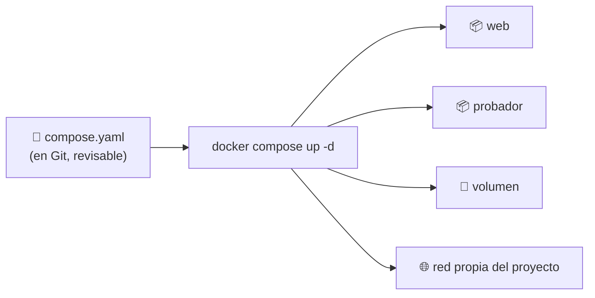

## B6.7.1 — De comandos larguísimos a un fichero: `compose.yaml`

> [!abstract] Ficha de la práctica
> ### 📌 `B6.7.1` — De comandos larguísimos a un fichero: `compose.yaml`
> - **Bloque 6** (Aislamiento de servicios) · **Fase B6.7** (Proyecto integrador) · **Nivel 2** (Intermedio) · **RA1** · **CE 1.b, 1.e**
> - **🎬 Playlist:** `B6_Contenedores`
> - **📹 Nombre del vídeo:** `B6.7.1 · De comandos larguísimos a compose.yaml`
> - **Requisito previo:** toda la Fase B6.4 y [[B6_6.2_Docker_Logs|B6.6.2]].

> [!info] Caso real (contexto profesional)
> Llevas seis semanas levantando servicios a mano. El comando de tu servicio web ya ocupa tres líneas: puerto, volumen, límite de memoria, rotación de registros, usuario sin privilegios. **El lunes te pones malo y tu compañero tiene que levantarlo.** ¿Se lo mandas por WhatsApp? ¿Y cuando cambie algo, quién se acuerda de qué se cambió y por qué?
>
> Esto no es un problema de Docker. Es el mismo problema que resolviste con Git en la Fase 0: **lo que no está escrito en un fichero, no existe.**

- **🎯 Objetivo real:** pasar de comandos memorizados a un **fichero de configuración versionable** que levante el servicio completo con un solo comando.
- **🧩 Problema que resuelve:** un servidor que solo sabe levantar quien lo montó no es un servidor profesional. **Seleccionar y configurar los componentes de la instalación es el CE 1.e.**

---

## 📚 Fundamento

> [!info] La idea: dejar de dar órdenes y pasar a describir el resultado
> Hasta hoy le has dicho a Docker **qué hacer**, paso a paso, en imperativo:
>
> ```bash
> docker run -d --name web -p 8080:80 -v /srv/sitio:/usr/share/nginx/html:ro \
>   --memory=128m --log-opt max-size=1m --log-opt max-file=3 --restart unless-stopped nginx:alpine
> ```
>
> Con Compose escribes **cómo tiene que quedar** y él se ocupa:
>
> ```yaml
> services:
>   web:
>     image: nginx:alpine
>     ports:
>       - "8080:80"
> ```
>
> A la primera forma se le llama **imperativa** (una receta de pasos); a la segunda, **declarativa** (una foto del destino). La declarativa gana en todo lo que importa: se lee, se guarda en Git, se revisa entre compañeros y **se puede repetir mil veces sin equivocarse**.



> [!info] Lo que te regala Compose sin pedirlo: una red propia
> Al levantar el proyecto, Compose crea **una red solo para él**. Y dentro de esa red **cada servicio se llama por su nombre**: desde el contenedor `probador` puedes hacer `curl http://web` y funciona.
>
> No hace falta saber la IP de nadie. **El nombre del servicio es el nombre de la máquina.** Esto en B6.3 lo tuviste que hacer a mano con puertos publicados; aquí sale solo.

> [!warning] El fallo nº1: el fichero mal indentado
> YAML es **implacable con los espacios**. Dos espacios de más y el fichero significa otra cosa; un tabulador y ni siquiera arranca.
>
> Dos reglas y te ahorras el 90 % de los disgustos:
> - **Espacios, nunca tabuladores.**
> - **Dos espacios por nivel**, siempre los mismos.
>
> Y antes de `up`, comprueba con el comando que te dice cómo ha entendido *él* tu fichero:
> ```bash
> docker compose config
> ```

> [!example] Vocabulario de esta práctica
> - **YAML:** formato de texto donde la **indentación es la estructura**. No es un capricho, es la sintaxis.
> - **Servicio:** cada contenedor descrito en el fichero. En Compose se llaman así.
> - **`docker compose up -d`:** levanta todo lo descrito, en segundo plano.
> - **`docker compose down`:** lo retira todo (contenedores y red). **Con `-v` se lleva también los volúmenes.**
> - **Declarativo:** describir el resultado, no los pasos.

---

## 📹 Grabación de esta práctica

> [!important] Obligaciones de grabación (LÉEME — es igual en TODAS las prácticas del bloque)
> 1. **Paso 0:** léete el ejercicio y ten a mano OBS y tu identificación.
> 2. **Arranca OBS y PRESÉNTATE** mostrando tu identidad (Teams o correo `@alu.edu.gva.es`).
> 3. **Timestamps SIEMPRE:** `00:00 Presentación` y uno por paso.
> 4. **Al terminar:** nombra el vídeo **`B6.7.1 · De comandos larguísimos a compose.yaml`** y súbelo a **`B6_Contenedores`** (No listado).
> 5. **Una sola entrega.**

---

## 🛠️ Procedimiento

> [!example] Paso 0 — Prepárate y empieza a grabar
> Arranca OBS en tu servidor Ubuntu y preséntate. Comprueba que tienes Compose (viene con Docker Engine desde B6.1.1):
> ```bash
> docker compose version
> ```
> Si dice `command not found`, instala el complemento:
> ```bash
> sudo apt install -y docker-compose-plugin
> ```
> **Ojo:** `docker compose` (con espacio) es la versión actual. `docker-compose` con guion es la vieja, ya retirada. Si sigues un tutorial con guion, está desactualizado.

> [!example] Paso 1 — Sufre el problema una última vez
> Levanta el servicio **a mano**, con todo lo que has aprendido en el bloque:
> ```bash
> sudo mkdir -p /srv/proyecto/sitio
> echo "<h1>Proyecto B6.7</h1>" | sudo tee /srv/proyecto/sitio/index.html
> docker run -d --name web -p 8080:80 \
>   -v /srv/proyecto/sitio:/usr/share/nginx/html:ro \
>   --memory=128m --log-opt max-size=1m --log-opt max-file=3 \
>   --restart unless-stopped nginx:alpine
> curl http://localhost:8080
> ```
> **Funciona.** Ahora, en el vídeo, intenta decir el comando de memoria sin mirar. Ese es el problema. Retíralo:
> ```bash
> docker rm -f web
> ```

> [!example] Paso 2 — Escribe el fichero
> ```bash
> mkdir -p ~/proyecto-b6 && cd ~/proyecto-b6
> mkdir -p sitio
> echo "<h1>Proyecto B6.7</h1>" > sitio/index.html
> nano compose.yaml
> ```
> Contenido:
> ```yaml
> services:
>   web:
>     image: nginx:alpine
>     container_name: b6_web
>     ports:
>       - "8080:80"
>     volumes:
>       - ./sitio:/usr/share/nginx/html:ro
>     restart: unless-stopped
>     mem_limit: 128m
>     logging:
>       driver: json-file
>       options:
>         max-size: "1m"
>         max-file: "3"
> ```
> **Léelo de arriba abajo en el vídeo y ve diciendo de qué práctica sale cada línea:** `ports` es B6.3.2, `volumes` con `:ro` es B6.4.2, `mem_limit` es B6.6.1, `logging` es B6.6.2. **El fichero es el resumen del bloque entero.**

> [!example] Paso 3 — Compruébalo antes de levantarlo
> ```bash
> docker compose config
> ```
> Te devuelve el fichero **tal y como lo ha entendido él**, completo. Si hay un error de indentación, aquí sale, y sale antes de romper nada.

> [!example] Paso 4 — Levanta el proyecto entero
> ```bash
> docker compose up -d
> docker compose ps
> curl http://localhost:8080
> ```
> **Un comando.** Tres líneas de configuración menos que recordar y ni un dato perdido.

> [!example] Paso 5 — Comprueba que respeta todo lo que pediste
> ```bash
> docker stats --no-stream b6_web
> docker inspect --format '{{.HostConfig.LogConfig}}' b6_web
> docker inspect --format '{{.HostConfig.RestartPolicy.Name}}' b6_web
> ```
> El `LIMIT` es **128 MiB**, la rotación está puesta y la política de reinicio también. **No ha hecho falta un solo `docker run`.**

> [!example] Paso 6 — Añade un segundo servicio y mira la red interna
> Edita `compose.yaml` y añade, al mismo nivel que `web`:
> ```yaml
>   probador:
>     image: alpine
>     container_name: b6_probador
>     depends_on:
>       - web
>     command: >
>       sh -c "apk add --no-cache curl >/dev/null &&
>              while true; do
>                echo -n 'web responde: ';
>                curl -s -o /dev/null -w '%{http_code}\n' http://web/;
>                sleep 10;
>              done"
> ```
> Y aplica el cambio:
> ```bash
> docker compose up -d
> docker compose logs -f probador
> ```
> Cada diez segundos: `web responde: 200`.
>
> **Mira bien la dirección: `http://web/`.** Sin IP y sin puerto publicado. El nombre del servicio funciona como nombre de máquina dentro de la red del proyecto. Sal con `Ctrl+C`.

> [!example] Paso 7 — Comprueba la red que te ha creado
> ```bash
> docker network ls | grep proyecto
> docker compose exec probador ping -c 2 web
> ```
> Hay una red **con el nombre de tu carpeta**, y dentro `web` resuelve a una IP. Esa red la ha creado Compose sin que se lo pidieras.

> [!example] Paso 8 — La demostración de que el fichero manda
> ```bash
> docker compose down
> docker ps -a
> docker compose up -d
> curl http://localhost:8080
> ```
> Lo has **destruido entero** y lo has vuelto a levantar idéntico, sin recordar nada. Repítelo en el vídeo diciéndolo:
>
> *"El servicio ya no vive en mi cabeza ni en mi historial de comandos. Vive en un fichero."*
>
> Esa frase es la práctica entera.

> [!example] Paso 9 — Cuidado con `down -v`
> ```bash
> docker compose down -v
> ```
> La `-v` **borra también los volúmenes** del proyecto. Aquí no pasa nada porque tus datos están en un *bind mount* (`./sitio`, en tu disco), pero **en un servicio con base de datos esa opción se lleva los datos por delante**.
>
> Compruébalo:
> ```bash
> ls sitio/
> docker compose up -d
> ```
> Tus ficheros siguen ahí. **Sabe exactamente qué borra cada comando antes de escribirlo.**

> [!example] Paso 10 — Cierra
> Deja el proyecto **levantado**: lo necesitas en B6.7.2.
> ```bash
> docker compose ps
> ```
> Detén OBS, nombra el vídeo **`B6.7.1 · De comandos larguísimos a compose.yaml`**, súbelo a **`B6_Contenedores`** y añade timestamps.

---

## 🚩 Errores y verificación

> [!warning] Errores típicos (evítalos)
> | Error | Qué pasa | Cómo evitarlo |
> | :--- | :--- | :--- |
> | Usar tabuladores en el YAML | No arranca, error de sintaxis | Espacios, dos por nivel. `docker compose config` antes. |
> | Poner `version: "3"` arriba | Avisa de que está obsoleto | Ya no se pone. Se empieza por `services:`. |
> | Usar `docker-compose` con guion | Comando no encontrado o versión vieja | `docker compose`, con espacio. |
> | Lanzar `up` desde otra carpeta | No encuentra el fichero | Compose trabaja **desde la carpeta del `compose.yaml`**. |
> | `docker compose down -v` sin pensar | **Te lleva los volúmenes y los datos** | `down` a secas. La `-v` solo cuando quieras borrar datos. |
> | Editar el fichero y no aplicar | Sigues con lo viejo y no entiendes nada | Vuelve a lanzar `docker compose up -d`. |

> [!success] ✅ Verificación: ¿está bien hecho?
> - `docker compose config` no da ningún error.
> - `docker compose up -d` levanta el servicio y `curl http://localhost:8080` responde.
> - El límite de memoria, la rotación de logs y el reinicio están puestos **desde el fichero**.
> - `probador` alcanza a `web` **por su nombre**, sin IP.
> - Has hecho `down` y `up` y ha quedado idéntico.
> - Sabes qué se lleva `down -v`.

> [!question] Comprueba que lo has entendido
> 1. Explica con tus palabras la diferencia entre imperativo y declarativo, con un ejemplo tuyo que no sea de Docker.
> 2. Coge tu `compose.yaml` y di, línea a línea, de qué práctica del bloque sale cada opción.
> 3. ¿Por qué `probador` puede llamar a `http://web` sin saber ninguna IP?
> 4. ¿Qué diferencia hay entre `docker compose down` y `docker compose down -v`? Pon un caso en el que la segunda sea un desastre.
> 5. Tu compañero tiene que levantar el servicio y tú estás de baja. ¿Qué le mandas exactamente y qué comando ejecuta?
> 6. Relaciónalo con la Fase 0: ¿por qué este fichero **tiene que** estar en Git y el historial de tu terminal no vale?

---

## ✅ Entregables y cierre

- **Entregable:** el fichero `compose.yaml` completo, con los dos servicios.
- **Entregable en vídeo:** la lectura comentada del fichero, el `up -d`, la comprobación de límites y rotación, `probador` llamando a `web` por su nombre, y el ciclo `down` → `up` dejándolo idéntico.
- **Entregable vídeo:** `B6.7.1 · De comandos larguísimos a compose.yaml` en `B6_Contenedores`. **Una sola entrega.**
- **Criterio de éxito:** levantar el servicio completo **desde un fichero**, sin comandos memorizados.

> [!summary] 🎓 Qué has aprendido en este ejercicio
> - Que un servicio se **describe** en un fichero, no se teclea de memoria.
> - Que `compose.yaml` recoge en veinte líneas todo lo que aprendiste suelto en el bloque.
> - Que Compose crea una **red propia** donde cada servicio se llama por su nombre.
> - Que se puede destruir y recrear un servicio entero **idéntico**, y que eso es lo que hace un sistema reproducible.
> - Que `down -v` borra datos: los comandos peligrosos se conocen **antes** de escribirlos.
>
> **Siguiente:** [[B6_7.2_Servicio_Desde_Cliente_Windows|B6.7.2 — Un servicio accesible desde el cliente Windows del dominio]].
