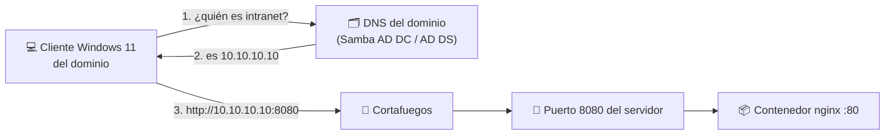

## B6.7.2 — Un servicio accesible desde el cliente Windows del dominio

> [!abstract] Ficha de la práctica
> ### 📌 `B6.7.2` — Un servicio accesible desde el cliente Windows del dominio
> - **Bloque 6** (Aislamiento de servicios) · **Fase B6.7** (Proyecto integrador) · **Nivel 3** (Avanzado) · **RA1, RA6** · **CE 1.i, 6.e**
> - **🎬 Playlist:** `B6_Contenedores`
> - **📹 Nombre del vídeo:** `B6.7.2 · Un servicio accesible desde el cliente Windows del dominio`
> - **Requisito previo:** [[B6_7.1_Compose|B6.7.1]] levantado, y tu **dominio Boochan** con el cliente Windows 11 unido.

> [!warning] Aquí se juntan las dos mitades del curso
> Hasta ahora el contenedor ha vivido dentro de tu servidor. Hoy sale a la red **de tu dominio** y lo usa un cliente Windows real, por su nombre, como cualquier otro servicio corporativo.
>
> Esta es la práctica donde el Bloque 6 deja de ser "una cosa de Docker" y se convierte en **un servicio más de la infraestructura que llevas montando desde octubre**.

> [!info] Caso real (contexto profesional)
> Dirección pide una intranet con los horarios y las circulares. Tienes que publicarla de forma que un profesor entre desde su portátil escribiendo un nombre que se pueda recordar —no una IP— y que funcione **el lunes por la mañana sin que tú estés delante**.

- **🎯 Objetivo real:** publicar el servicio en la red del dominio, darle **nombre en el DNS** y **comprobar la conectividad desde el cliente Windows**.
- **🧩 Problema que resuelve:** un servicio que solo responde en `localhost` no le sirve a nadie. **Comprobar la conectividad cliente-servidor es el CE 1.i.**

---

## 📚 Fundamento

> [!info] Tres saltos, y hay que darlos en orden
> Para que el profesor escriba un nombre y le salga tu página, tienen que funcionar **tres cosas distintas**. Cuando algo falla, falla una de las tres, y hay que saber cuál:
>
> | # | Salto | Si falla, el síntoma es... | Herramienta |
> |---|---|---|---|
> | 1️⃣ | El contenedor publica en la **IP del servidor**, no solo en `localhost` | Funciona en el servidor, no fuera | `ss -tlnp` |
> | 2️⃣ | El **cortafuegos** deja pasar el puerto | Conexión rechazada o se queda colgado | `ufw status` |
> | 3️⃣ | El **DNS del dominio** traduce el nombre a la IP | *"No se puede encontrar el servidor"* | `nslookup` |
>
> **Diagnosticar es ir de abajo arriba.** Nunca empieces por el navegador del cliente: empieza por el puerto en el servidor.



> [!warning] El fallo nº1: publicar solo en `localhost`
> En B6.3.2 aprendiste `-p 8080:80`. Eso publica en **todas** las interfaces del servidor y es lo que quieres hoy.
>
> Pero existe la variante `-p 127.0.0.1:8080:80`, que publica **solo para el propio servidor**. Con ella el `curl` local funciona de maravilla y desde el cliente Windows no responde nada. Es un fallo que cuesta una tarde entera si no se conoce.
>
> Y ojo, porque **la variante restringida no es un error**: para un servicio que solo debe consumir la propia máquina, es exactamente lo correcto. Lo que hay que saber es **cuál de las dos estás usando y por qué**.

> [!example] Vocabulario de esta práctica
> - **Interfaz de escucha:** en qué IP del servidor atiende un puerto. `0.0.0.0` es "en todas".
> - **`ss -tlnp`:** qué puertos escuchan, en qué IP y de qué proceso. **El primer comando del diagnóstico.**
> - **Registro A:** entrada de DNS que traduce **un nombre a una IPv4**.
> - **`ufw`:** el cortafuegos de Ubuntu.
> - **`Test-NetConnection`:** el comprobador de conectividad de PowerShell. Distingue *"no resuelve el nombre"* de *"el puerto está cerrado"*.

---

## 📹 Grabación de esta práctica

> [!important] Obligaciones de grabación (LÉEME — es igual en TODAS las prácticas del bloque)
> 1. **Paso 0:** léete el ejercicio y ten a mano OBS y tu identificación. **Crea la entrada de apuntes de esta práctica** en Obsidian: fichero `b6-7-2-un-servicio-accesible-desde-el-cliente-window.md` dentro de `00_Apuntes/Trimestre_N/B6_Contenedores/`, con la estructura de la Fase 0.1 y **vacía**. Rellenarla es cosa tuya, después.
> 2. **Arranca OBS y PRESÉNTATE** mostrando tu identidad (Teams o correo `@alu.edu.gva.es`).
> 3. **Timestamps SIEMPRE:** `00:00 Presentación` y uno por paso.
> 4. **Al terminar:** nombra el vídeo **`B6.7.2 · Un servicio accesible desde el cliente Windows del dominio`** y súbelo a **`B6_Contenedores`** (No listado). Y **pega su enlace dentro de tu entrada de apuntes**, en el apartado `Enlace al vídeo explicativo`.
> 5. **Una sola entrega.**

---

## 🛠️ Procedimiento

> [!example] Paso 0 — Prepárate y empieza a grabar
> Arranca OBS. Vas a moverte entre **el servidor Ubuntu y el cliente Windows 11**: dilo al empezar y avisa cada vez que cambies de máquina, o el vídeo no se entiende.
> ```bash
> cd ~/proyecto-b6
> docker compose ps
> hostname -I
> ```
> **Anota la IP del servidor.** La vas a usar en todos los pasos.

> [!example] Paso 1 — Salto 1: ¿en qué IP escucha el servicio?
> ```bash
> sudo ss -tlnp | grep 8080
> ```
> Tiene que aparecer **`0.0.0.0:8080`** (o `*:8080`). Si pusiera `127.0.0.1:8080`, el servicio solo se ve desde el propio servidor y **no hay nada que hacer hasta arreglarlo**.
>
> Compruébalo desde el propio servidor, pero **por su IP real**, no por `localhost`:
> ```bash
> curl http://$(hostname -I | awk '{print $1}'):8080
> ```
> Si esto responde, el salto 1 está resuelto.

> [!example] Paso 2 — Salto 2: abre el cortafuegos
> ```bash
> sudo ufw status
> ```
> Si está activo, el puerto no pasa hasta que lo digas:
> ```bash
> sudo ufw allow 8080/tcp comment 'Intranet en contenedor B6.7'
> sudo ufw status numbered
> ```
> **Abre solo el puerto que necesitas y con comentario.** Dentro de seis meses, un `ufw status` lleno de reglas sin explicar no lo entiende ni quien las puso.

> [!example] Paso 3 — Primera prueba desde el cliente Windows (por IP)
> Vete al **cliente Windows 11** del dominio y abre PowerShell:
> ```powershell
> Test-NetConnection -ComputerName 10.10.10.10 -Port 8080
> ```
> *(Cambia la IP por la tuya.)* Busca **`TcpTestSucceeded : True`**. Y en el navegador:
> ```
> http://10.10.10.10:8080
> ```
> **Ahí está tu página, servida desde un contenedor Linux, vista desde Windows.** Grábalo: es el momento en que el servicio sale del servidor.
>
> Si falla, no sigas: vuelve al Paso 1. **El orden del diagnóstico no se salta.**

> [!example] Paso 4 — Salto 3: dale un nombre en el DNS del dominio
> Una IP no la recuerda nadie. Añade un **registro A** en tu DNS.
>
> **Si tu servidor es Ubuntu + Samba AD DC** (V1, V2, V3), desde el servidor:
> ```bash
> samba-tool dns add localhost boochanlab.local intranet A 10.10.10.10 \
>   -U administrator
> samba-tool dns query localhost boochanlab.local intranet A -U administrator
> ```
>
> **Si tu servidor es Windows Server + AD DS** (V1.1, V2.1, V3.1), en PowerShell del controlador:
> ```powershell
> Add-DnsServerResourceRecordA -Name "intranet" -ZoneName "boochanlab.local" -IPv4Address "10.10.10.10"
> Get-DnsServerResourceRecord -ZoneName "boochanlab.local" -Name "intranet"
> ```
>
> Ajusta **la zona y la IP a las tuyas** (en las versiones de nube la zona es `boochan.space`). Di en el vídeo cuál es tu caso.

> [!example] Paso 5 — Comprueba la resolución desde el cliente
> En el cliente Windows:
> ```powershell
> ipconfig /flushdns
> nslookup intranet.boochanlab.local
> ```
> Tiene que devolver **la IP de tu servidor**. Si dice *"No existe"*, comprueba que el cliente usa **el controlador de dominio como DNS**:
> ```powershell
> Get-DnsClientServerAddress -AddressFamily IPv4
> ```
> Este es exactamente el mismo diagnóstico que hiciste al unir el cliente al dominio. **El servicio en contenedor no cambia nada de eso.**

> [!example] Paso 6 — La prueba final: por nombre
> ```powershell
> Test-NetConnection -ComputerName intranet.boochanlab.local -Port 8080
> ```
> Y en el navegador:
> ```
> http://intranet.boochanlab.local:8080
> ```
> **Un usuario del dominio, en un Windows del dominio, entra por un nombre del dominio a un servicio que corre en un contenedor Linux.** Esa frase es el bloque entero y el RA6 al completo. Dila en el vídeo, despacio.

> [!example] Paso 7 — Publícalo en el puerto de verdad (80)
> Un usuario no escribe `:8080`. Edita `compose.yaml`:
> ```yaml
>     ports:
>       - "80:80"
> ```
> Y aplica:
> ```bash
> docker compose up -d
> sudo ufw allow 80/tcp comment 'Intranet B6.7'
> sudo ss -tlnp | grep ':80 '
> ```
> Desde el cliente, ahora sin puerto:
> ```
> http://intranet.boochanlab.local
> ```
> **Ya parece un servicio de verdad.** Si el puerto 80 te da `address already in use`, algo lo ocupa en el servidor (B6.3.3): mira quién con `ss -tlnp` antes de tocar nada.

> [!example] Paso 8 — Comprueba que sobrevive a un reinicio
> ```bash
> sudo reboot
> ```
> Espera, vuelve a entrar y **desde el cliente Windows** recarga la página **sin tocar el servidor**.
>
> Sigue funcionando gracias al `restart: unless-stopped` de B6.7.1. Este es el requisito del caso real: *"que funcione el lunes sin que tú estés delante"*. Compruébalo también en el servidor:
> ```bash
> docker compose ps
> ```

> [!example] Paso 9 — El registro de los accesos reales
> ```bash
> docker compose logs web | tail -10
> ```
> Ahí están las peticiones **con la IP del cliente Windows**. Los registros de B6.6.2, ahora con tráfico de verdad: así se comprueba quién ha entrado y desde dónde.

> [!example] Paso 10 — Cierra
> Deja el servicio levantado y funcionando: es lo que entregas en B6.7.3.
>
> Detén OBS, nombra el vídeo **`B6.7.2 · Un servicio accesible desde el cliente Windows del dominio`**, súbelo a **`B6_Contenedores`** y añade timestamps.

---

## 🚩 Errores y verificación

> [!warning] Errores típicos (evítalos)
> | Error | Qué pasa | Cómo evitarlo |
> | :--- | :--- | :--- |
> | Publicar en `127.0.0.1` | Va en el servidor, no desde el cliente | `sudo ss -tlnp` y busca `0.0.0.0`. |
> | Empezar el diagnóstico por el navegador | Das palos de ciego | Puerto → cortafuegos → DNS, **en ese orden**. |
> | Olvidar `ufw allow` | La conexión se queda colgada | `ufw status` antes de probar desde fuera. |
> | Que el cliente no use el DC como DNS | El nombre no resuelve aunque el registro exista | `Get-DnsClientServerAddress`. |
> | No vaciar la caché de DNS | Sigues viendo el fallo ya arreglado | `ipconfig /flushdns`. |
> | Abrir el puerto a toda la red sin pensar | Servicio expuesto de más | Solo el puerto necesario, con comentario. |
> | Probar por IP y decir que "funciona por nombre" | El salto 3 no está comprobado | `nslookup` **y** navegador por nombre. |

> [!success] ✅ Verificación: ¿está bien hecho?
> - `ss -tlnp` muestra el servicio escuchando en **`0.0.0.0`**.
> - El cortafuegos tiene la regla, con comentario.
> - `Test-NetConnection` da **`TcpTestSucceeded : True`** desde el cliente.
> - `nslookup intranet.<tu dominio>` devuelve la IP del servidor.
> - El navegador del cliente abre la página **por nombre y sin puerto**.
> - Tras reiniciar el servidor, **sigue funcionando sin tocar nada**.
> - En los registros aparece la IP del cliente Windows.

> [!question] Comprueba que lo has entendido
> 1. Enumera los tres saltos y di, para cada uno, el comando que lo comprueba.
> 2. Un compañero dice: *"me funciona con `curl localhost` pero desde Windows no"*. ¿Qué le preguntas primero y por qué?
> 3. ¿Qué diferencia hay entre `-p 8080:80` y `-p 127.0.0.1:8080:80`? Pon un caso real en el que la segunda sea la correcta.
> 4. ¿Por qué el cliente Windows tiene que usar el controlador de dominio como servidor DNS?
> 5. `Test-NetConnection` da `PingSucceeded: True` pero `TcpTestSucceeded: False`. ¿Qué falla, y cuál de los tres saltos descartas?
> 6. Explica, con tus palabras y en cuatro líneas, todo el recorrido desde que el profesor escribe el nombre hasta que ve la página.

---

## ✅ Entregables y cierre

- **Entregable:** en el vídeo, los tres saltos comprobados uno a uno (`ss`, `ufw`, `nslookup`), el acceso desde el cliente Windows **por nombre**, y la prueba del reinicio.
- **Entregable escrito:** el registro DNS creado (comando y comprobación) y la salida de `Test-NetConnection` por nombre.
- **Entregable vídeo:** `B6.7.2 · Un servicio accesible desde el cliente Windows del dominio` en `B6_Contenedores`. **Una sola entrega.**
- **Criterio de éxito:** que un cliente Windows del dominio use el servicio **por su nombre**, y que sepas diagnosticar los tres saltos por separado.
- **Entregable apuntes:** `b6-7-2-un-servicio-accesible-desde-el-cliente-window.md` en `B6_Contenedores/`, con la estructura completa, las **respuestas a las preguntas de «Comprueba que lo has entendido»** y el **enlace del vídeo** dentro. Subida al repo con `git add` → `commit` → `push`.

> [!danger] ⚠️ Las respuestas van en la ENTRADA, no sueltas
> Las preguntas de esta práctica no son decorativas: son lo que demuestra que has entendido lo que hiciste, y no solo que supiste seguir los pasos. Se contestan **con tus palabras** en el apartado `Respuesta a las preguntas` de tu entrada.
> Una práctica con el vídeo perfecto y las preguntas en blanco está **incompleta**.

> [!summary] 🎓 Qué has aprendido en este ejercicio
> - Que publicar un servicio son **tres saltos independientes**: escucha, cortafuegos y DNS.
> - Que el diagnóstico se hace **de abajo arriba**, y que empezar por el navegador es perder la tarde.
> - Que un contenedor se integra en tu dominio como **un servicio más**: mismo DNS, mismo cliente, mismas herramientas.
> - Que `restart: unless-stopped` es lo que hace que el servicio esté vivo el lunes por la mañana.
> - Que la integración libre ↔ propietario del RA6 acaba siendo esto: **un Windows del dominio usando un servicio Linux por su nombre**.
>
> **Siguiente:** [[B6_7.3_Versionar_En_GitHub|B6.7.3 — Versionar el proyecto en GitHub y entregar]].
